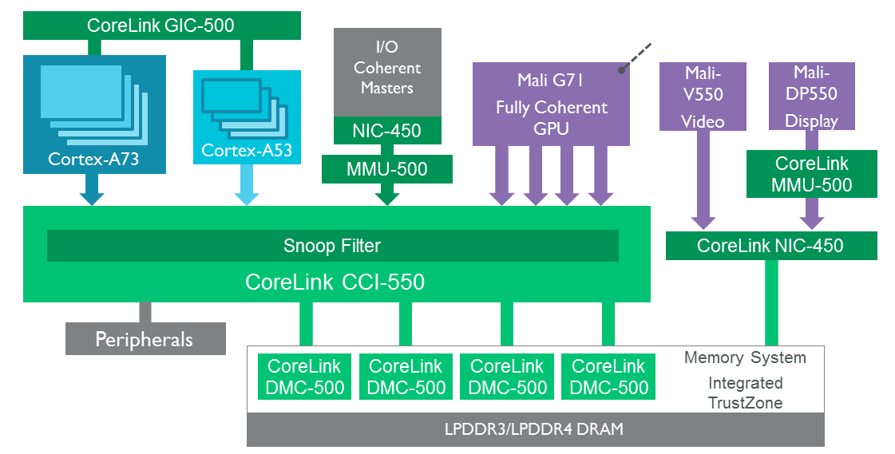
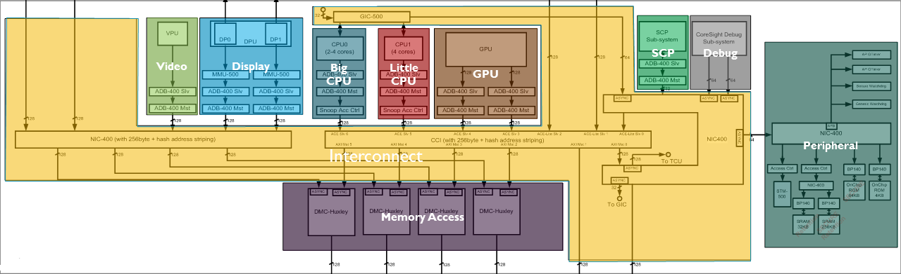
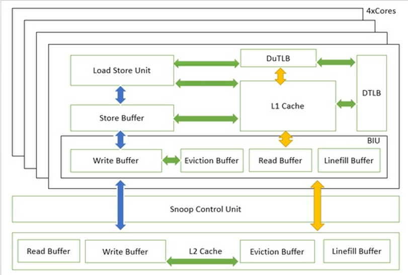
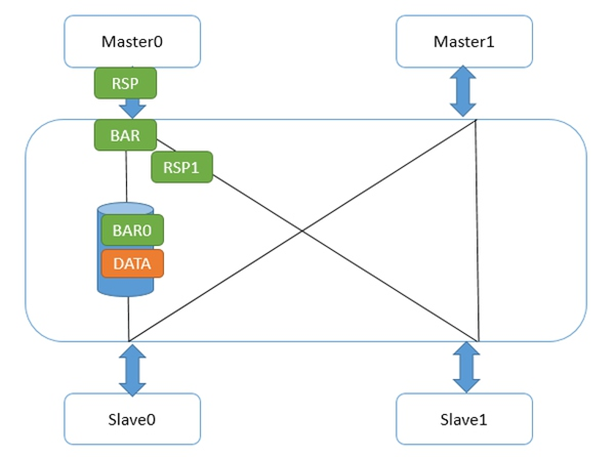
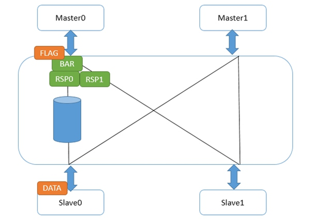
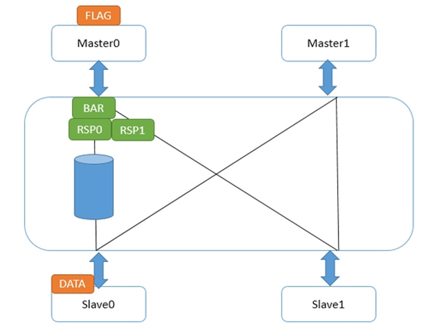
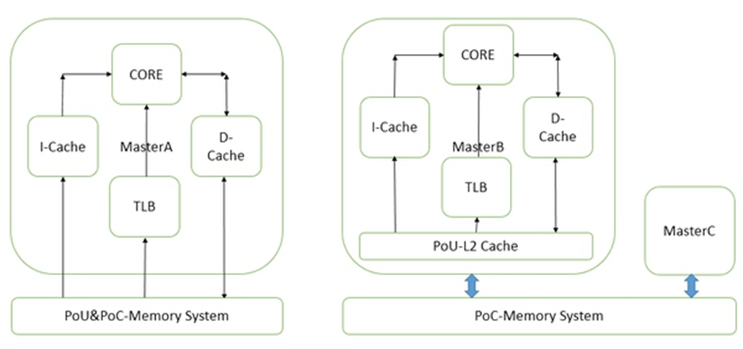

[TOC]
### ARM SoC
> 

> 

### Load/Store
> 
>
> Read Buffer、Write Buffer：与下一级存储设备进行数据交互
>
> Eviction Buffer：cache line换出缓冲
> 
> Linefill Buffer：cache line填充缓冲
#### Load
> Non-Cacheable
> > LSU => L1 Cache(if miss => Read Buffer)
>
> Cacheable
> > LSU => L1 Cache(if miss Eviction Buffer & Linefill Buffer)
#### Store
> Non-Cacheable
> > LSU => Write Buffer
>
> Cacheable
> > LSU => L1 Cache(if miss Eviction Buffer & Linefill Buffer)

### Memory Barrier
**DMB**
> 要求上一条读写指令发出请求后可以继续下一条读写指令的请求
>
> 
>
> Master0发出data，又发出DMB，Master0接口回复壁垒响应，Slave0接口收到壁垒请求，等待data到达，Master0发出第二个数据，因为它已经收到它的所有下级(Master0接口)的壁垒回应，所以它又写出了flag
>
> =>
>
> 
>
> flag在Master0接口中等待它的所有下一级接口的壁垒响应。而data达到了Slave0后，壁垒响应走到了Master0接口，flag继续往下走

**DSB**
> 要求上一条读写指令完成后才能开始下一个请求
>
> 
>
> 与DMB区别：Master0接口在收到壁垒请求后，不立即回复壁垒响应，而等待收到所有下一级接口的壁垒响应，才发送自身的壁垒响应给Master0，此时上一条读写指令已经完成

### PoU/PoC
> 
**PoU**
> 对于某一个核Master，附属于它的指令，数据缓存和TLB，如果在某一点上，它们能看到一致的内容，那么这个点就是PoU。

**PoC**
> 对于系统中所有Master（注意是所有的，而不是某个核），如果存在某个点，它们的指令，数据缓存和TLB能看到同一个源，那么这个点就是PoC。

### Inner/Outer/Non Shareable
> 页属性，页表设定，定义了操作被广播的范围

### 指令集、异常、MMU等（该部分细节参考ARM文档）
```
指令（realview汇编器指南）
  ARM指令
  NEON&VFP指令
MMU
  一级、二级映射，建立相应页表
```
