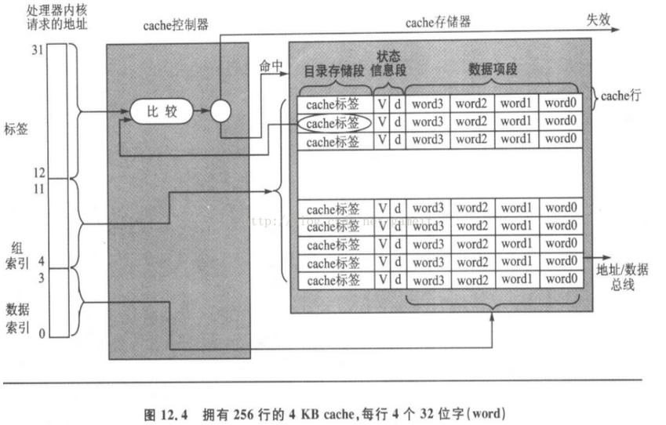

## CPU架构
[TOC]

### 体系结构(ISA)
```
CISC 指令数量多，功能多，变长
RISC 指令数量少，功能简单，定长
```
>

### 微架构
#### pipeline
##### 经典5级流水线
>

##### 流水线冒险
###### 结构冒险
>

###### 数据冒险
>
>
>
>
>
>
>
>
>

###### 控制冒险
```
如果程序的实际执行路径是要跳转到其他的地址去执行，那么流水线中已经做 的取指和译码工作就白做了。

处理：硬件冲刷流水线Or软件增加Nop指令排空流水线
```

##### 分支预测
```
根据历史信息来对跳转指令进行预测

典型分支预测算法：
```
```
    1位预测
```
>
```
    2位预测
```
>

##### 乱序执行
```
某个指令执行时需要等待，先执行后面不依赖该数据的指令
```
###### 指令相关性
>

###### 去除指令相关性
* 去数据相关：软件尽量减少
* 去控制相关：分支预测，投机执行
* 去伪相关：将ISA寄存器重新映射到处理器内部的物理寄存器（寄存器重命名）
>

###### 乱序执行实现
>
```
指令调度
  分析指令间的相关性，分析指令什么时候能开始执行。
  指令能否开始执行， 依赖于两个条件：
  （1）是否有空闲的功能单元去执行这条指令。
  （2）该指令的源操作数是否已经准备好。

顺序提交
  乱序执行后，指令的这个结果并没有立即提交到ISA 寄存器中，而是先缓存起来，只有当前指令前面的指令提交后，这条指令才能提交。
```
>

##### 并行
###### 指令并行
* Superscaler 处理器实现，兼容
>
* VLIW 软件实现
>
* Superscaler实例 P4流水线
```
  前端
```
>
```
  后端
```
>

###### 数据并行
```
SIMD
  ARM NEON
```

###### 线程并行
* 硬件多线程
```
  粗粒度
```
>
```
  细粒度
```
>
```
  同时多线程（SMT）
```
>
* 多核

#### Cache-memory系统
>
##### 映射方式
```
1. Full- associative Cache（全关联Cache） 任意映射
2. Direct- mapped Cache（直接映射Cache）
3. Set- associative Cache（组关联Cache）
```
>

##### Cache write
```
write through(write buffer)
write back
  Cache miss
    no-write-allocate
    write allocate
      Random FIFO LRU
```
##### Cache地址
```
1. VIVT（Virtual index Virtual tag）。寻找cache set的index和匹配cache line的tag都是使用虚拟地址。存在cache alias
2. PIPT（Physical index Physical tag）。寻找cache set的index和匹配cache line的tag都是使用物理地址。
3. VIPT（Virtual index Physical tag）。寻找cache set的index使用虚拟地址，而匹配cache line的tag使用的是物理地址。Set index+offset>12 存在cache alias
```
##### Cache一致性
###### MESI protocol
>
>
>

###### Cache系统结构（MESI之类协议引起，带来memory order问题，引入memory barrier来解决）
>
