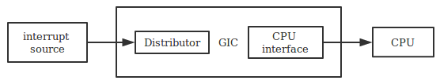
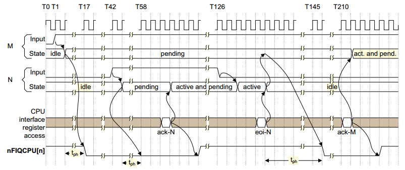
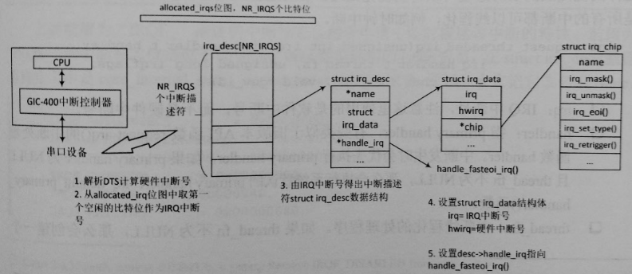
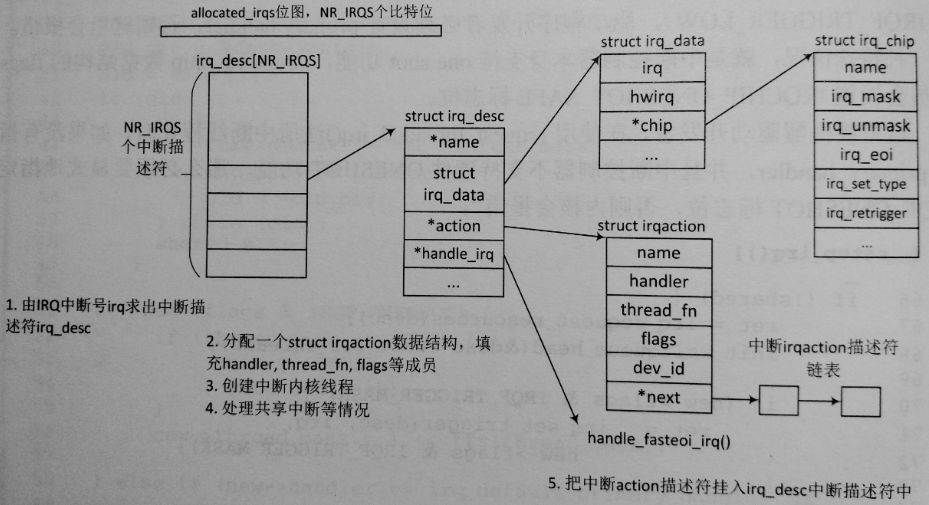

[TOC]

## 中断
### GIC

>
**示例：**
>
>
> _N的优先级高于M_

```
irq domain
中断描述符
hwirq<-->irq  mapping
  线性映射
  radix tree
```
>线性映射
>
>

### 注册
```
request_threaded_irq->__setup_irq
```
>

### 处理
#### Top half
```
irq_mode=>svc_mode
  1. 硬件保存返回地址到lr_irq，CPSR到spsr_irq
  2. Irq_mod: 12字节的栈（保存被中断mode下r0，PC，CPSR）
    1044     @
    1045     @ Save r0, lr_<exception> (parent PC) and spsr_<exception>
    1046     @ (parent CPSR)
    1047     @
    1048     stmia   sp, {r0, lr}        @ save r0, lr
    1049     mrs lr, spsr
    1050     str lr, [sp, #8]        @ save spsr
  3. svc_mod: 保存被中断mode下的context

high level handle & specific handle
  gic_handle_irq(handle_arch_irq)
    read GICC_IAR(bit[9:0] hwirq ACK)
    handle_domain_irq
      irq_enter
      generic_handle_irq
        handle_fasteoi_irq
          handle_irq_event
            handle_irq_event_percpu
      irq_exit
```

#### Bottom half

##### softirq

> * 开中断执行
> * __softirq_pending 每个bit代表一个softirq
> * 每个CPU上的softirq串行执行，不允许嵌套
> * 同一个softirq可以在不同CPU并发执行，故需考虑同步问题


##### tasklet
> * 每个CPU都有两个tasklet list，普通优先级TASKLET_SOFTIRQ，高优先级HI_SOFTIRQ
> * 同一个tasklet一个时间点只能在一个cpu上执行，不能在多个CPU上并发执行

##### workqueue
> CMWQ
> * wq=>thread pool
> * bound(normal highpri)/unbound
> * work在thread pool中处理，thread pool由wq共享，thread pool管理worker，某个work阻塞，系统会唤醒idle的worker
```c
  处理work伪代码：
    worker_thread()
    {
    recheck:
      if (!need_more_worker)
        goto sleep
      if (!may_start_working && manage_workers)
        goto recheck
      do {
        process_one_work
      } while (keep_working)
    sleep:
      schedule
    }

  调度器的配合：
    __schedule
      /*
       * If a worker went to sleep, notify and ask workqueue
       * whether it wants to wake up a task to maintain
       * concurrency.
       */
      if (prev->flags & PF_WQ_WORKER) {
        struct task_struct *to_wakeup;

        to_wakeup = wq_worker_sleeping(prev, cpu);
        if (to_wakeup)
          try_to_wake_up_local(to_wakeup);
      }
```
