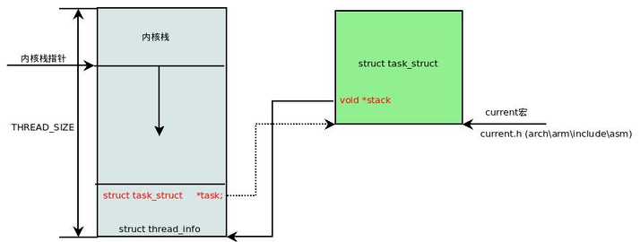
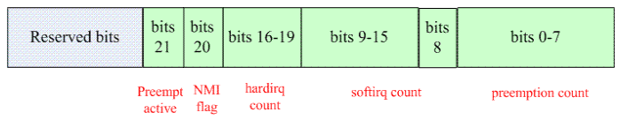
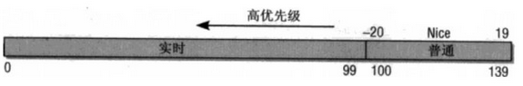
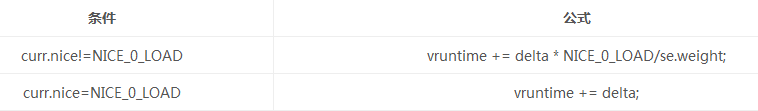
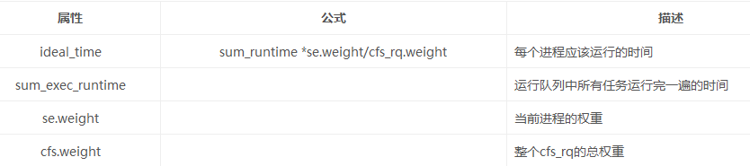
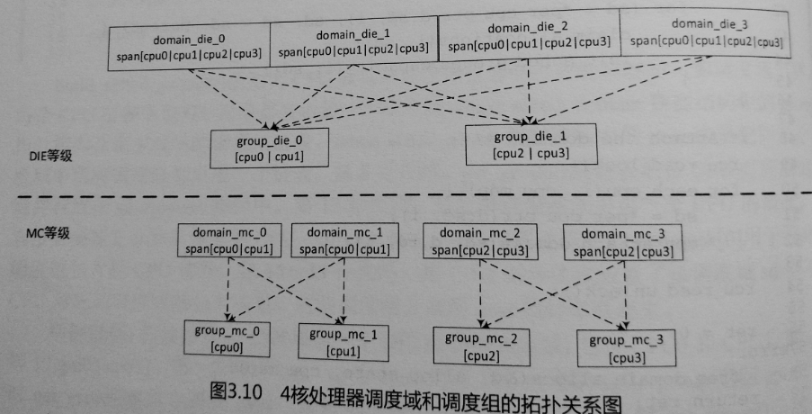
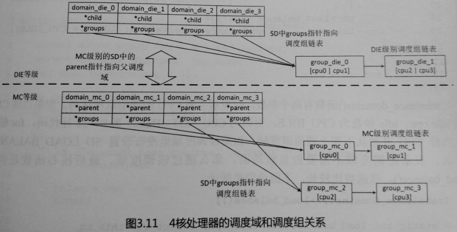

## 进程管理与调度
[TOC]

```
task_struct
  void *stack;
    union thread_union
    {
      struct thread_info thread_info;
      unsigned long stack[THREAD_SIZE/sizeof(long)];
    };
```
>

### fork
```c
long do_fork(unsigned long clone_flags,  unsigned long stack_start, unsigned long stack_size, int __user *parent_tidptr, int __user *child_tidptr)
```
*****
```c
fork
  do_fork(SIGCHLD, 0, 0, NULL, NULL);
vfork
  do_fork(CLONE_VFORK | CLONE_VM | SIGCHLD, 0, 0, NULL, NULL);
  CLONE_VFORK 父进程挂起，直到子进程释放VM（execve exit）
clone
  do_fork(clone_flags, newsp, 0, parent_tidptr, child_tidptr);
内核线程
  do_fork(flags | CLONE_VM | CLONE_UNTRACED, (unsigned long)fn, (unsigned long)arg, NULL, NULL);
```
*******
```
  do_fork
    copy_progress
      dup_task_struct 分配task_struct和thread_info实例，并从父进程拷贝内容
      Sched_fork
        __sched_fork 初始化调度相关数据结构
        设置sched_class
        set_task_cpu
        init_task_preempt_count
      copy_files
      copy_fs
      copy_signal
      copy_io
      copy_mm
        dup_mm
          分配mm，并从父进程拷贝内容
        mm_init
          初始化mm，分配PGD页表，从init进程拷贝内核空间的PGD页表
        dup_mmap
          复制父进程VMAS中对应的pte页表项
            copy_pte_range
              copy_one_pte
      copy_thread 分配pid
      wake_up_new_task
```

### schedule
#### scheduler_tick
```
更新系统相关统计量

激活负责当前进程调度类的周期性调度方法（如CFS）
  se、rq相关更新操作（还有添加进程到rq中时，如唤醒进程）
  检查设置need_resched（唤醒进程会直接设置）
```

#### __schedule
```
选择和切换到一个合适的进程运行
pick_next_task
  执行调度类中的pick_next_task，如果当前进程的调度类是CFS，且系统就绪队列的进程数量等于CFS就绪队列进程数量，则说明只有普通进程，否则遍历所有调度类，顺序为stop->dl->rt->fair->idle
context_switch
```

#### 调度时机(发生在内核空间时即内核抢占)
>* 从系统调用或者异常中断返回用户空间时（check TIF_NEED_RESCHED）
>* 从中断上下文返回内核空间时（check  preempt_count & TIF_NEED_RESCHED）
>* preempt_count从正整数变为0时（check TIF_NEED_RESCHED, then preempt_schedule）
>* 显式的调用schedule()
>* 任务阻塞
>* 唤醒进程时(隐式)
```c
__irq_svc->svc_preempt->preempt_schedule_irq

asmlinkage __visible void __sched preempt_schedule_irq(void)
{
	enum ctx_state prev_state;

	/* Catch callers which need to be fixed */
	BUG_ON(preempt_count() || !irqs_disabled());

	prev_state = exception_enter();

	do {
		preempt_disable();
		local_irq_enable();
		__schedule(true);
		local_irq_disable();
		sched_preempt_enable_no_resched();
	} while (need_resched());

	exception_exit(prev_state);
}
```
**preempt_count**
>
```
local_bh_disable/enable(enable会执行do_softirq（满足条件）)
preempt_disable/enable(enable会触发调度（满足条件）)
```
```c
  static void __sched notrace preempt_schedule_common(void)
  {
  	do {
  		preempt_disable_notrace();
  		__schedule(true);//判断(!preempt && prev->state)，把不在运行状态下且不是被抢占的进程移出就绪队列
  		preempt_enable_no_resched_notrace();

  		/*
  		 * Check again in case we missed a preemption opportunity
  		 * between schedule and now.
  		 */
  	} while (need_resched());
  }
```

#### context_switch
```c
  mm
  if (!mm) { //内核进程
  	next->active_mm = oldmm;
  	atomic_inc(&oldmm->mm_count);
  	enter_lazy_tlb(oldmm, next);
  } else //用户进程
  	switch_mm(oldmm, mm, next);

  switch_mm 实质是把新进程的页表基地址设置到页表基地址寄存器中
      #TLB的处理（ARM）
          mm->context.id: bit[0-7]:ASID, bit[8-31]:generation（ASID溢出增加ASID_FIRST_VERSION）

          asid = find_next_zero_bit(asid_map, NUM_USER_ASIDS, cur_idx);
          if (asid == NUM_USER_ASIDS) {//ASID溢出
          	generation = atomic64_add_return(ASID_FIRST_VERSION,
          					 &asid_generation);
          	flush_context(cpu); //冲刷TLB
          	asid = find_next_zero_bit(asid_map, NUM_USER_ASIDS, 1); //asid_map清零
          }
      #cpu_switch_mm=>cpu_v7_switch_mm
        设置TTBR和ASID

  switch_to=>__switch_to
    把prev进程相关寄存器上下文保存到该进程thread_info->cpu_context，再把next进程thread_info->cpu_context恢复到CPU寄存器
```

#### 优先级
>

#### CFS
    nice=>weight=>vruntime
>
>
>
```
关键函数：calc_delta_fair，sched_slice，__calc_delta

sysctl_sched_latency 默认6ms，可通过/proc/sys/kernel/sched_latency_ns控制
sysctl_sched_min_granularity 默认0.75ms，可通过/proc/sys/kernel/sched_min_granularity_ns设置
sched_nr_latency是内核在一个延迟周期中处理的最大活动进程数目
sum_runtime、ideal_time

加入进程：enqueue_entity
          place_entity
            新进程：vruntime += sched_vslice(cfs_rq, se)，sched_vslice函数就将一个时间片转换为等价的虚拟时间
            唤醒进程：vruntime -= thresh; thresh=sysctl_sched_latency; if GENTLE_FAIR_SLEEPERS thresh >>= 1;
            se->vruntime = max_vruntime(se->vruntime, vruntime);
```

#### 负载
```
[<- 1024us ->|<- 1024us ->|<- 1024us ->| ...
      p0           p1           p2
    (now)      (~1ms ago)   (~2ms ago)
load_avg = u_0` + y*(u_0 + u_1*y + u_2*y^2 + ... )

4.0
  runnable_avg_sum：调度实体在就绪队列中可运行状态下总的衰减累加时间
  runnable_avg_period：调度实体系统中的总的衰减累加时间

  runnable_avg_sum = prev_avg_sum + contrib
  load_avg_contrib = runnable_avg_sum * weight / runnable_avg_period

  关键函数：
    update_entity_load_avg
      __update_entity_runnable_avg
      decay_load
      __compute_runnable_contrib
      __update_entity_load_avg_contrib

4.4
  load_sum：调度实体系统中的总的衰减累加时间
  load_avg：load_sum/LOAD_AVG_MAX
  runnable_load_sum：就绪队列总的衰减累加时间
  runnable_load_avg：runnable_load_sum/LOAD_AVG_MAX

  关键函数：
    __update_load_avg
      sa->load_sum = decay_load(sa->load_sum, periods + 1);
      contrib = __compute_runnable_contrib(periods);
      contrib = cap_scale(contrib, scale_freq);
      sa->load_sum += weight * contrib;
      if (cfs_rq)
          cfs_rq->runnable_load_sum += weight * contrib;
```

#### 组调度
> CFS为例
> * 创建组调度tg时，tg为每个CPU同时创建组调度内部使用的cfs_rq就绪队列
> * 组调度作为一个调度实体加入系统CFS就绪队列rq->cfs_rq中
> * 进程加入一个组后，就脱离了系统CFS就绪队列，加入组调度的CFS就绪队列tg->cfs_rq中
> * 选择下一个进程时，从系统CFS就绪队列开始，如果选中的se是组调度tg，则从tg的就绪队列中选中一个进程

#### SMP负载均衡
##### CPU域
> 
>
> 

##### load_balance
```
for_each_domain(cpu, sd)
load_balance
  should_we_balance 当前CPU是该调度域中的第一个CPU，或者当前CPU是idle CPU
  find_busiest_group 在调度域中找到最繁忙的调度组，更新调度域和调度组相关信息，计算出该调度域的不均衡负载值（imbalance）
  detach_task、attach_tasks 在最繁忙的调度组中找到最繁忙的CPU，把该CPU上的进程迁移到当前CPU，迁移负载量位不均衡负载值
```
