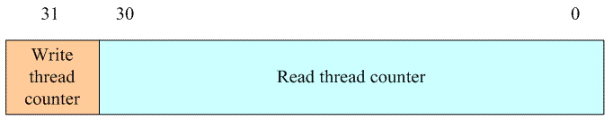

[TOC]

## 同步
```
原因：中断、内核抢占、smp导致资源的并发访问
```
### 原子操作（arch-dependent）
```c
ARM：ldrex, strex
static inline void atomic_add(int i, atomic_t *v)
{
    unsigned long tmp;
    int result;

    prefetchw(&v->counter);
    __asm__ __volatile__("@ atomic_add\n"
"1:    ldrex    %0, [%3]\n"
"    add    %0, %0, %4\n"
"    strex    %1, %0, [%3]\n" －－－是否能够正确的操作的状态标记保存在％1操作数中
"    teq    %1, #0\n" －－－检查是否成功
"    bne    1b"
    : "=&r" (result), "=&r" (tmp), "+Qo" (v->counter) －－－对应％0，％1，％2
    : "r" (&v->counter), "Ir" (i) －－－－－－－－－－－－－对应％3，％4
    : "cc");
}
```

### per-cup变量
```
".data..percpu..." sections
```

### spinlock
>ARM
>
> 
>
> (图中为aarch64指令)
```c
static inline void arch_spin_lock(arch_spinlock_t *lock)
{
    unsigned long tmp;
    u32 newval;
    arch_spinlock_t lockval;

    prefetchw(&lock->slock);//预取到cache
    /* 把lock->slock保存到临时变量lockval，同时对next原子加一 */
    __asm__ __volatile__(
"1:    ldrex    %0, [%3]\n"
"    add    %1, %0, %4\n"
"    strex    %2, %1, [%3]\n"
"    teq    %2, #0\n"
"    bne    1b"
    : "=&r" (lockval), "=&r" (newval), "=&r" (tmp)
    : "r" (&lock->slock), "I" (1 << TICKET_SHIFT)
    : "cc");

    /* 自旋直到本地next等于全局owner */
    while (lockval.tickets.next != lockval.tickets.owner) {
        wfe();
        lockval.tickets.owner = ACCESS_ONCE(lock->tickets.owner);
    }

    smp_mb();
}
```
使用的时机：临界区很小、中断（多核才可出现，UP会导致重入）

### rwspinlock
ARM
```c
typedef struct {
    u32 lock;
} arch_rwlock_t;
```
> 

### seqlock
```
顺序计数器：sequence
write_seqlock,write_sequnlock：sequence都加一，写的过程中sequence为奇数
读者在读数据前后读sequence并比较，不等则重复
```

### 信号量
```c
struct semaphore {
	raw_spinlock_t		lock;
	unsigned int		count; //允许进入临界区的内核执行路径个数
	struct list_head	wait_list; //获取锁失败的进程在该链表睡眠，释放锁时唤醒链表中第一个成员
};
```

### 互斥体
```c
struct mutex {
	/* 1: unlocked, 0: locked, negative: locked, possible waiters */
	atomic_t		count;
	spinlock_t		wait_lock;
	struct list_head	wait_list;
#if defined(CONFIG_DEBUG_MUTEXES) || defined(CONFIG_MUTEX_SPIN_ON_OWNER)
	struct task_struct	*owner;
#endif
#ifdef CONFIG_MUTEX_SPIN_ON_OWNER
	struct optimistic_spin_queue osq; /* Spinner MCS lock */
#endif
#ifdef CONFIG_DEBUG_MUTEXES
	void			*magic;
#endif
#ifdef CONFIG_DEBUG_LOCK_ALLOC
	struct lockdep_map	dep_map;
#endif
};
```
**自旋等待机制**
>struct optimistic_spin_queue osq; /* Spinner MCS lock */
>
> 
```
mutex_optimistic_spin
  mutex_can_spin_on_owner
  osq_lock
  mutex_spin_on_owner
  mutex_try_to_acquire
```

### 读写信号量
```c
struct rw_semaphore {
	long count;
	struct list_head wait_list;
	raw_spinlock_t wait_lock;
#ifdef CONFIG_RWSEM_SPIN_ON_OWNER
	struct optimistic_spin_queue osq; /* spinner MCS lock */
	/*
	 * Write owner. Used as a speculative check to see
	 * if the owner is running on the cpu.
	 */
	struct task_struct *owner;
#endif
#ifdef CONFIG_DEBUG_LOCK_ALLOC
	struct lockdep_map	dep_map;
#endif
};
```
**count**
```
bit[0~15]：表示正在持有锁的读者或写者的个数
bit[16~31]：表示有一个正在持有或pending状态的写者，以及睡眠等待队列中有人在睡眠等待
```
> 

### RCU
```
1.发布订阅
  rcu_dereference() rcu_assign_pointer()
2.旧版本释放
  synchronize_rcu() Release
  Call_rcu,  rcu_check_callbacks(tick中)
  rcu_check_callbacks
    rcu_sched_qs
    rcu_bh_qs
    rcu_preempt_qs
    rcu_process_callbacks(if rcu_pending)
      rcu_check_quiescent_state
        rcu_report_qs_rdp
          rcu_report_qs_rnp
            rcu_report_qs_rsp
      rcu_start_gp(if cpu_needs_another_gp)
      cpu_needs_another_gp
      invoke_rcu_callbacks(if cpu_has_callbacks_ready_to_invoke)
```
> 

> 
> * RCU_DONE_TAIL指向的rcu_head对象之前的对象是可以销毁的对象。<br>
> * RCU_WAIT_TAIL指向的正在等待宽限期的元素。<br>
> * RCU_NEXT_READY_TAIL指向的是等待下次宽限期的元素。<br>
> * RCU_NEXT_TAIL指向最后一个元素，这个元素总是指向NULL。

### 完成量

### memory barrier
```
barriers() 禁止编译优化导致的乱序
ARM：
数据内存屏障（DMB）：在DMB之后的显示的内存访问执行前，保证所有在DMB指令之前的内存访问完成。
数据同步屏障（DSB）：等待所有在DSB指令之前的指令完成（之后再执行后续的指令）。
指令同步屏障（ISB）：清除（flush）流水线，使得所有ISB之后执行的指令都是从cache或内存中获得的（而不是流水线中的）。

原因，原理见perfbook
```
