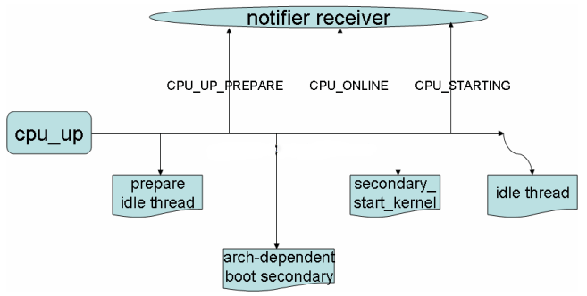

[TOC]

## 时间
* clocksoure
* clockevent
* tick
```
Period/Oneshot
HZ/NOHZ
Hrtimer
```
* clockevent处理：
```
HZ：
  tick_handle_periodic->tick_periodic
                          update_wall_time
                          update_process_times
NOHZ_MODE_LOWRES：
  tick_nohz_handler
    tick_sched_do_timer
    tick_sched_handle
NOHZ_MODE_HIGHRES:
  hrtimer_interrupt
    tick_sched_timer(tick handled as a hrtimer)
      tick_sched_do_timer
      tick_sched_handle
```
* 模式切换
```
period=>NOHZ_MODE_LOWRES
tick_handle_periodic->tick_periodic->update_process_times
                                      ->run_local_timers
                                        ->hrtimer_run_queues
                                          ->tick_check_oneshot_change
                                            ->tick_nohz_switch_to_nohz
                                              ->tick_switch_to_oneshot(tick_nohz_handler)
NOHZ_MODE_LOWRES=>NOHZ_MODE_HIGHRES
tick_nohz_handler->tick_sched_handle->update_process_times
                                        ->run_local_timers
                                          ->hrtimer_run_queues
                                            ->hrtimer_switch_to_hres
                                              ->tick_init_highres
                                                ->tick_switch_to_oneshot(hrtimer_interrupt)
```

* idle中的处理
```
  1. 若关闭local timer，设置Broadcast tick
  2. tick_nohz_idle_enter
      停止tick（如果下一个定时器的到期时间与当前jiffies相差大于1时）
      设置下一个定时器的到期时间（不能超过max_idle_ns）
```
* tick_sched
```
tick_sched_do_timer->tick_do_update_jiffies64->update_wall_time->timekeeping
tick_sched_handle->update_process_times->account_process_tick(user/sys(irq,sirq,sys)/idle)
                                         run_local_timers->raise TIMER_SOFTIRQ
                                         rcu_check_callbacks
                                         scheduler_tick
                                         run_posix_cpu_timers
```

## SMP boot


bootCPU为secondaryCPU创建idle线程，设置运行地址，唤醒secondcpu secondary_startup

## 设备模型
```
device driver bus-----------|
kobject ktype uevent--------|---->sysfs
kset------------------------|
class(往往是符号链接)--------|
```

## 电源管理
```
suspend/resume

wakeup
  wakeup_source
    pm_stay_awake(activate wakeup event)
    pm_relax(deactivate wakeup event)

  event_count、active_count、wakeup_count（阻止休眠的次数）

  外部产生，如中断
  内部产生，如防止执行某些代码时休眠
    用户空间（wake_lock）
```

## CPU core管理
* CPU idle
```
governor:
  ladder(periodic timer tick system)
  menu(tickless system)
    predicted_us  latency_req
```
* cpufreq （包含regulator）
```
frequency table
governor
```
* cpuhotplug
> cpu_up
>
>

> cpu_down


## ARM boot
```
Asm part:
  关键行为：
  stext->__create_page_tables->__enable_mmu->__mmap_switched->start_kernel

  参数的处理：
  r0  = cp#15 control register
  r1  = machine ID
  r2  = atags/dtb pointer
  r9  = processor ID

    .long   processor_id            @ r4
    .long   __machine_arch_type     @ r5
    .long   __atags_pointer         @ r6
  #ifdef CONFIG_CPU_CP15
    .long   cr_alignment            @ r7
  #else
    .long   0               @ r7
  #endif
     .long   init_thread_union + THREAD_START_SP @ sp
     .size   __mmap_switched_data, . - __mmap_switched_data

  ARM(   ldmia   r3, {r4, r5, r6, r7, sp})
  THUMB( ldmia   r3, {r4, r5, r6, r7}    )
  THUMB( ldr sp, [r3, #16]       )
     str r9, [r4]            @ Save processor ID
     str r1, [r5]            @ Save machine type
     str r2, [r6]            @ Save atags pointer
     cmp r7, #0
     strne   r0, [r7]            @ Save control register values

  1. create page tables to enable mmu
  2. call start_kernel with param
```
