[TOC]

### glibc ptmalloc
```
主分配区: heap mmap
非主分配区 ：mmap
```
#### chunk
> in use
>
> 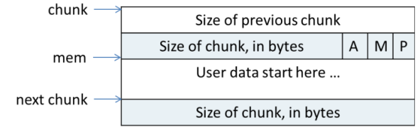
>
> free
>
> 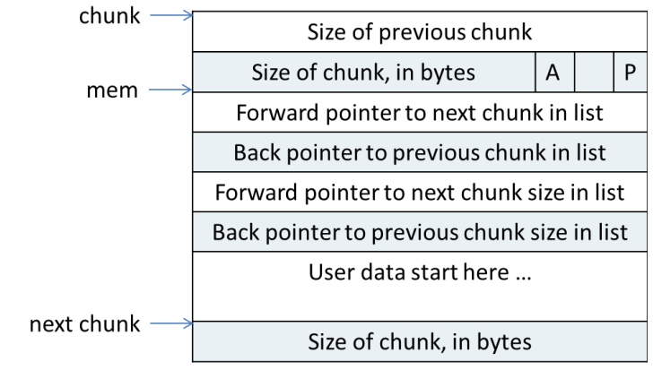

#### bins(空闲chunk容器)
> 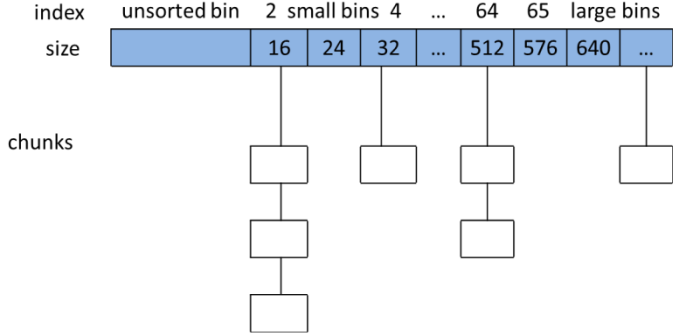
```
small bins中的chunk 按照最近使用顺序进行排列
large bins 中的每一个 bin 分别包含了一个给定范围内的 chunk，其中的 chunk 按大小序排列。相同大小的 chunk 同样按照最近使用顺序排列。
fast bins: 不大于 max_fast（默认值为64B）的chunk 被释放后，首先会被放到 fast bins中
unsorted bin 的队列使用 bins 数组的第一个， 如果被用户释放的 chunk 大于 max_fast，或者 fast bins 中的空闲 chunk 合并后，这些 chunk 首先会被放到 unsorted bin 队列中
top chunk:
  非主分配区 sub-heap top
  主分配区的 top chunk 在第一次调用 malloc 时会分配一块(chunk_size + 128KB)align 4KB 大小的空间作为初始的 heap
mmaped chunk
last remainder

分配顺序：
fast bins-->(unsorted bin)bins-->top chunk-->mmaped chunk
small chunk：small bins-->last remainder
```

### RT
* 临界区可抢占（部分spinlock换成mutex，按优先级排队）
>优先级反转
>
>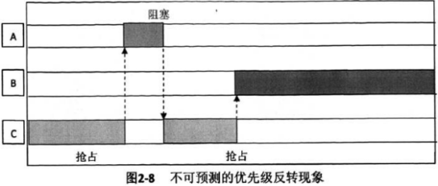
* 高精度时钟
* 中断线程化 (可选，如tick没有线程化)
* 软中断线程化 (同上)
* 实时调度算法

### 栈溢出调试
>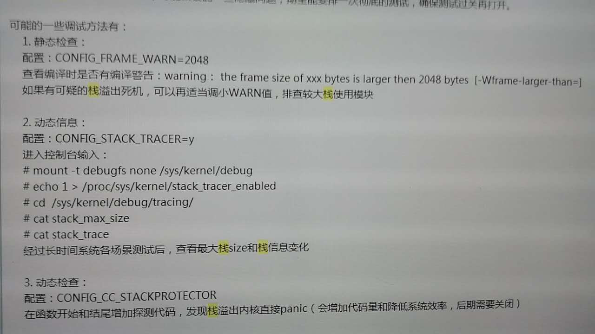
>
>3. gcc  -fstack-protector

### 红黑树
#### 二叉树
##### 结构
>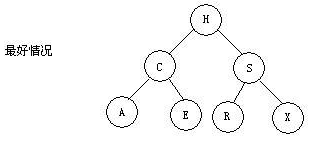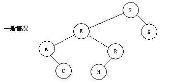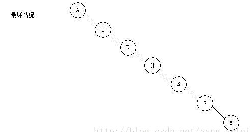

#### 2-3查找树
##### 结构
>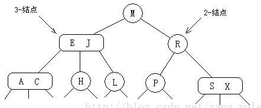
##### 构造过程
>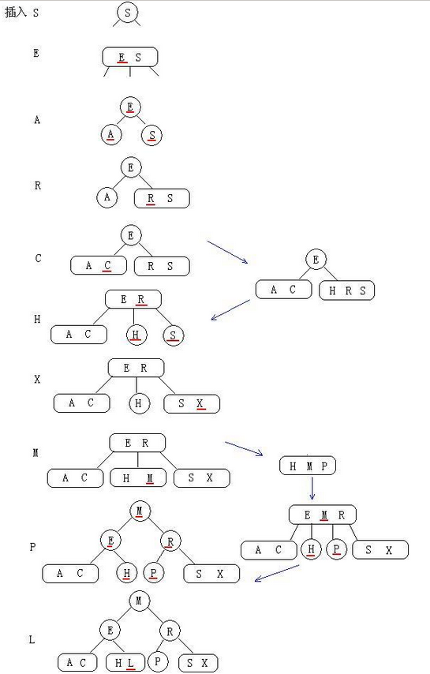

#### 红黑树
##### 结构
>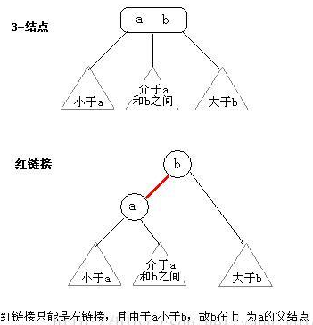
##### 构造过程
>

### 其他
```
编译、链接原理，链接脚本编写
  C==>asm，数据段中数据地址保存在text段中(Label)，用于访问
```
#### 数据长度
>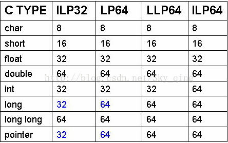

#### Debug
```
Objdump、addr2line
Ftrace
gdb
Strace、ltrace
perf
```

#### Uboot
```
Relocation
  指令：b,bl地址无关
  全局变量：利用rel.dyn段修改地址
            rel.dyn段存有label地址，加上offset找到新地址，对其内容加上offset即为全局变量新地址
Sdram空间
  top-->hide mem-->logbuff-->pram-->tlb space(16K)-->framebuffer space-->uboot code space-->addr-->malloc len-->bd len-->gd len-->fdt-->12 byte-->addr_sp
```

#### 开源许可证
>

#### driver
##### USB
>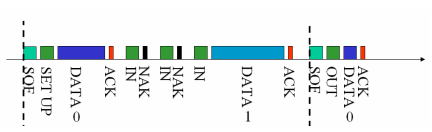
>
>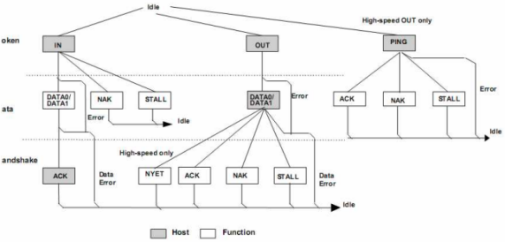
>
>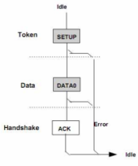 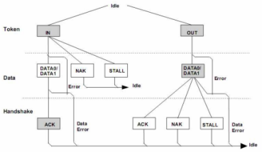 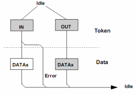
* Setup:
> 标准设备请求
>
> 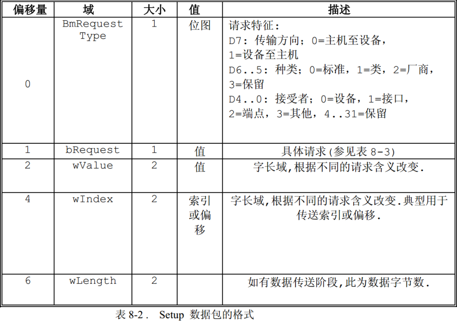
> 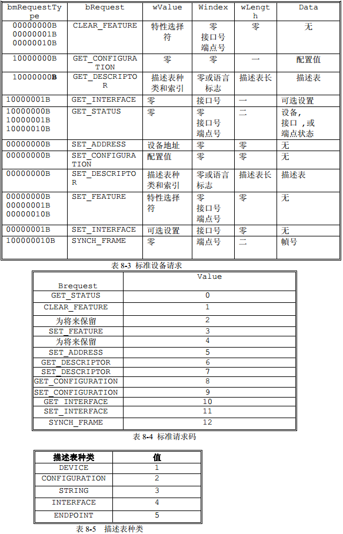
