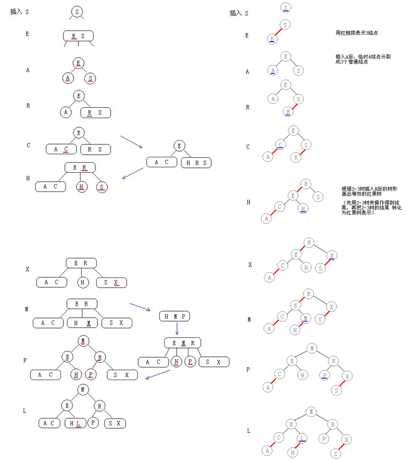
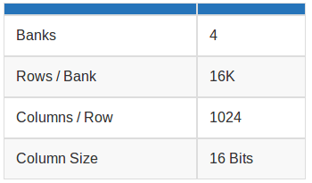
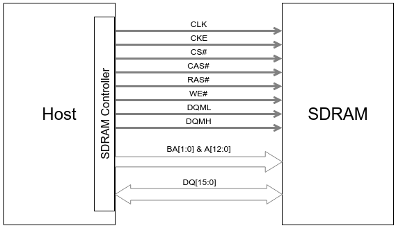

[TOC]

### glibc ptmalloc
```
主分配区: heap mmap
非主分配区 ：mmap
```
#### chunk
> in use
>
> 
>
> free
>
> 

#### bins(空闲chunk容器)
> 
```
small bins中的chunk 按照最近使用顺序进行排列
large bins 中的每一个 bin 分别包含了一个给定范围内的 chunk，其中的 chunk 按大小序排列。相同大小的 chunk 同样按照最近使用顺序排列。
fast bins: 不大于 max_fast（默认值为64B）的chunk 被释放后，首先会被放到 fast bins中
unsorted bin 的队列使用 bins 数组的第一个， 如果被用户释放的 chunk 大于 max_fast，或者 fast bins 中的空闲 chunk 合并后，这些 chunk 首先会被放到 unsorted bin 队列中
top chunk:
  非主分配区 sub-heap top
  主分配区的 top chunk 在第一次调用 malloc 时会分配一块(chunk_size + 128KB)align 4KB 大小的空间作为初始的 heap
mmaped chunk
last remainder

分配顺序：
fast bins-->(unsorted bin)bins-->top chunk-->mmaped chunk
small chunk：small bins-->last remainder
```

### RT
* 临界区可抢占（部分spinlock换成mutex，按优先级排队）
>优先级反转
>
>
* 高精度时钟
* 中断线程化 (可选，如tick没有线程化)
* 软中断线程化 (同上)
* 实时调度算法

### 栈溢出调试
>
>
>3. gcc  -fstack-protector

### 红黑树
#### 二叉树
##### 结构
>

#### 2-3查找树
##### 结构
>
##### 构造过程
>

#### 红黑树
##### 结构
>
##### 构造过程
>

### 其他
```
编译、链接原理，链接脚本编写
  C==>asm，数据段中数据地址保存在text段中(Label)，用于访问
```
#### 数据长度
>

#### Debug
```
Objdump、addr2line
Ftrace
gdb
Strace、ltrace
perf
```

#### Uboot
```
Relocation
  指令：b,bl地址无关
  全局变量：利用rel.dyn段修改地址
            rel.dyn段存有label地址，加上offset找到新地址，对其内容加上offset即为全局变量新地址
Sdram空间
  top-->hide mem-->logbuff-->pram-->tlb space(16K)-->framebuffer space-->uboot code space-->addr-->malloc len-->bd len-->gd len-->fdt-->16 byte-->addr_sp
```

#### 开源许可证
>

#### driver
##### USB
>
>
>
>
>  
* Setup:
> 标准设备请求
>
> 
> 

##### UBI
###### UBI简介
>**Overview**
>
>UBI全称"Unsorted Block Images"。它是工作于raw flash devices之上的volume管理系统，它管理一个单一physical flash设备上的多个logical volume，能够把I/O负载均匀的分发到flash chip上。
>
>在一定意义上，UBI可以和Logical Volume Manager相比较。LVM映射logical sector到物理sectors，UBI映射logical eraseblcok到physical eraseblocks。但是除了映射，UBI还实现了wear-leveling和透明的I/O错误的管理。
>
>一个UBI volume是一组连续的logical eraseblocks(LEBs)。每一个逻辑eraseblcok可以被映射为任意的physical eraseblock。这个映射是由UBI管理，并且对上层隐藏了global wear-leveling机制（记录per-physical eraseblock erase counters 以及透明的移动more worn-out数据到less worn-out上）。
>
>UBI volume在创建时确定尺寸大小，也可以在日后改变（volume是动态re-sizable）。UBI有user-space工具可以用来管理UBI volumes。
>
>有两种UBI volume，动态的和静态的。静态volumes是只读的，内容由CRC-32 checksums保护；而动态volume是read-write，上层负责确保数据的完整性。
>
>UBI处理坏块，上层不需要关心坏块管理。UBI有一个保留的physical eraseblocks pool，当一个physical eraseblock变成坏块，UBI透明的用一个好physical block替换这个坏块。UBI把新出现的physical eraseblock的数据移动到好physical eraseblock。UBI volume对发生的事毫无察觉。
>
>NAND flashes在读写操作时可能会发生bit-flips。Bit-flips通过ECC checksums纠正，但是积累到一定数据可能会发生数据丢失。UBI会移动发生bit-flips的数据到另外一个physical eraseblocks。这个过程叫scrubbing。scrubbing过程是后台的，并且对上层透明。

详见[UBI介绍](http://blog.csdn.net/kickxxx/article/details/6707589#t8)

###### UBI Volume
> **Calculations**
>
> Usable Size Calculation
>
>As documented here, UBI reserves a certain amount of space for management and bad PEB handling operations. Specifically:
>
>    2 PEBs are used to store the UBI volume table
    1 PEB is reserved for wear-leveling purposes;
    1 PEB is reserved for the atomic LEB change operation;
    a % of PEBs is reserved for handling bad EBs. The default for NAND is 1%
    UBI stores the erase counter (EC) and volume ID (VID) headers at the beginning of each PEB. 1 min I/O unit is required for each of these.
>
> To calculate the full overhead, we need the following values:
 Symbol    Meaning     Value for XO test case
 W     total number of physical eraseblocks on the flash chip (NB: the entire chip, not the MTD partition)
 SP    PEB Size    128KiB
 SL    LEB Size    128KiB - 2 * 2KiB = 124 KiB
 P     Ttotal number of physical eraseblocks on the MTD partition  200MiB / 128KiB = 1600
 BB    number of bad blocks on the MTD partition;
 BR    number of PEBs reserved for bad PEB handling. it is 20 * W/1024 for NAND by default, and 0 for NOR and other flash types which do not have bad PEBs
 B     B - MAX(BR,BB);
 O     The overhead related to storing EC and VID headers in bytes, i.e. O = SP - SL   4KiB
>
> UBI Overhead = (B + 4) * SP + O * (P - B - 4)
       = (16 + 4) * 128Kib + 4 KiB * (1600 - 16 - 4)
       = 8880 KiB
       = 69.375 PEBs (round to 69)

##### DRAM
**Organization**
> 

> 
>
>Row
>>DRAM Memory 中的 Row 与 Wordline 是一一对应的，一个 Row 本质上就是所有接在同一根 Wordline 上的 Cells
>
>Column
>>Column 是 Memory Array 中可寻址的最小单元。一个 Row 中有 n 个 Column，其中 n = Row Size / Data Width。
>
>Column size(Data width)
>>一个 Column 的 Size 即为该 Column 上所包含的 Cells 的数量，与 Data Width 相同。

**Interface**
> 

**Operations**
>Active
>>Active Command 会通过 BA[1:0] 和 A[12:0] 信号，选中指定 Bank 中的一个 Row，并打开该 Row 的 wordline。在进行 Read 或者 Write 前，都需要先执行 Active Command。
>
>Read
>>Read Command 将通过 A[12:0] 信号，发送需要读取的 Column 的地址给 SDRAM。然后 SDRAM 再将 Active Command 所选中的 Row 中，将对应 Column 的数据通过 DQ[15:0] 发送给 Host。
>>
>>Host 端发送 Read Command，到 SDRAM 将数据发送到总线上的需要的时钟周期个数定义为 CL。
>
>Write
>>Write Command 将通过 A[12:0] 信号，发送需要写入的 Column 的地址给 SDRAM，同时通过 DQ[15:0] 将待写入的数据发送给 SDRAM。然后 SDRAM 将数据写入到 Actived Row 的指定 Column 中。
>>
>>SDRAM 接收到最后一个数据到完成数据写入到 Memory 的时间定义为 tWR （Write Recovery）。
>
>Precharge
>>在进行下一次的 Read 或者 Write 操作前，必须要先执行 Precharge 操作。（具体的细节可以参考 DRAM Storage Cell 章节）
>>
>>Precharge 操作是以 Bank 为单位进行的，可以单独对某一个 Bank 进行，也可以一次对所有 Bank 进行。如果 A10 为高，那么 SDRAM 进行 All Bank Precharge 操作，如果 A10 为低，那么 SDRAM 根据 BA[1:0] 的值，对指定的 Bank 进行 Precharge 操作。
>>
>>SDRAM 完成 Precharge 操作需要的时间定义为 tPR。
>
>Auto-Refresh
>>DRAM 的 Storage Cell 中的电荷会随着时间慢慢减少，为了保证其存储的信息不丢失，需要周期性的对其进行刷新操作。
>>
>>SDRAM 的刷新是按 Row 进行，标准中定义了在一个刷新周期内（常温下 64ms，高温下 32ms）需要完成一次所有 Row 的刷新操作。
>>
>>为了简化 SDRAM Controller 的设计，SDRAM 标准定义了 Auto-Refresh 机制，该机制要求 SDRAM Controller 在一个刷新周期内，发送 8192 个 Auto-Refresh Command，即 AR， 给 SDRAM。
>>
>>SDRAM 每收到一个 AR，就进行 n 个 Row 的刷新操作，其中，n = 总的 Row 数量 / 8192 。
>>此外，SDRAM 内部维护一个刷新计数器，每完成一次刷新操作，就将计数器更新为下一次需要进行刷新操作的 Row。
>>
>>一般情况下，SDRAM Controller 会周期性的发送 AR，每两个 AR 直接的时间间隔定义为 tREFI = 64ms / 8192 = 7.8 us。
>>
>>SDRAM 完成一次刷新操作所需要的时间定义为 tRFC, 这个时间会随着 SDRAM Row 的数量的增加而变大。
>>
>>由于 AR 会占用总线，阻塞正常的数据请求，同时 SDRAM 在执行 refresh 操作是很费电，所以在 SDRAM 的标准中，还提供了一些优化的措施，例如 DRAM Controller 可以最多延时 8 个 tREFI 后，再一起把 8 个 AR 同时发出。
>>
>
>Self-Refresh
>>Host 还可以让 SDRAM 进入 Self-Refresh 模式，降低功耗。在该模式下，Host 不能对 SDRAM 进行读写操作，SDRAM 内部自行进行刷新操作保证数据的完整。通常在设备进入待机状态时，Host 会让 SDRAM 进入 Self-Refresh 模式，以节省功耗。

详见[DRAM原理](http://www.wowotech.net/basic_tech/307.html)
