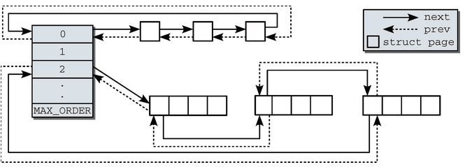
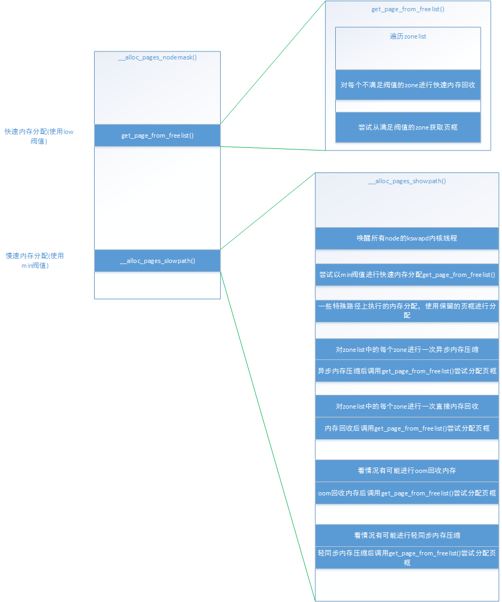
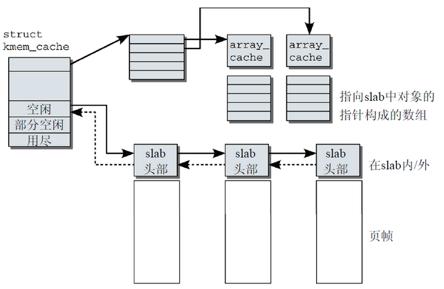
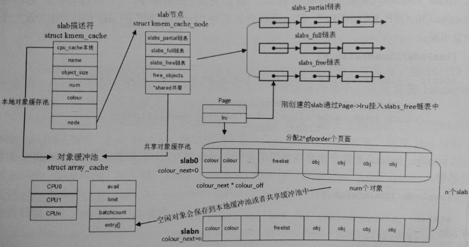
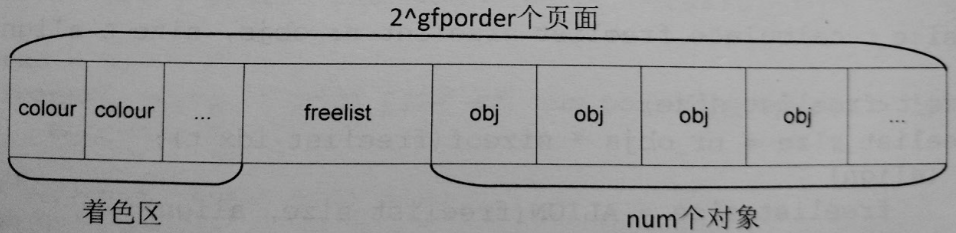
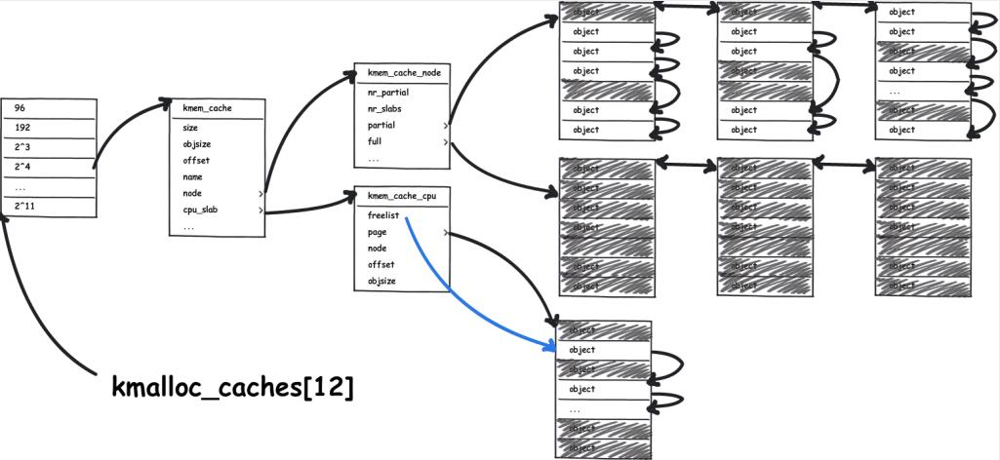

## 内存分配
[TOC]

### buddy system
>
#### alloc_pages
> gfp_mask
```
Zone modifiers：__GFP_DMA __GFP_HIGHMEM __GFP_DMA32 __GFP_MOVABLE

Page mobility and placement:
##define __GFP_RECLAIMABLE ((__force gfp_t)0x80000u) /* 页是可回收的 */
#define __GFP_WRITE ((__force gfp_t)___GFP_WRITE)
#define __GFP_HARDWALL ((__force gfp_t)0x20000u) /* 只允许在进程允许运行的CPU所关联
                                                  * 的结点分配内存 */
#define __GFP_THISNODE ((__force gfp_t)0x40000u) /* 没有备用结点，没有策略 */
#define __GFP_ACCOUNT ((__force gfp_t)___GFP_ACCOUNT)

Watermark modifiers:
#define __GFP_ATOMIC ((__force gfp_t)___GFP_ATOMIC)
#define __GFP_HIGH ((__force gfp_t)0x20u) /* 应该访问紧急分配池 */
#define __GFP_MEMALLOC ((__force gfp_t)___GFP_MEMALLOC)
#define __GFP_NOMEMALLOC ((__force gfp_t)0x10000u) /* 不使用紧急分配链表 */

Page reclaim modifiers:
#define __GFP_IO ((__force gfp_t)0x40u) /* allocator can start physical I/O (swap) to
reclaim memory */
#define __GFP_FS ((__force gfp_t)0x80u) /* allocator may call down to the low-level FS
for reclaim */
#define __GFP_DIRECT_RECLAIM ((__force gfp_t)___GFP_DIRECT_RECLAIM) /* Caller can reclaim */
#define __GFP_KSWAPD_RECLAIM ((__force gfp_t)___GFP_KSWAPD_RECLAIM) /* kswapd can wake */
#define __GFP_RECLAIM ((__force gfp_t)(___GFP_DIRECT_RECLAIM|___GFP_KSWAPD_RECLAIM))
#define __GFP_REPEAT ((__force gfp_t)0x400u) /* 重试分配，可能失败 */
#define __GFP_NOFAIL ((__force gfp_t)0x800u) /* 一直重试，不会失败 */
#define __GFP_NORETRY ((__force gfp_t)0x1000u) /* 不重试，可能失败 */

Action modifiers：
#define __GFP_COLD ((__force gfp_t)0x100u) /* 需要非缓存的冷页 */
#define __GFP_NOWARN ((__force gfp_t)0x200u) /* 禁止分配失败警告 */
#define __GFP_COMP ((__force gfp_t)0x4000u) /* 增加复合页元数据 */
#define __GFP_ZERO ((__force gfp_t)0x8000u) /* 成功则返回填充字节0的页 */
#define __GFP_NO_GROW ((__force gfp_t)0x2000u) /* slab内部使用 */
#define __GFP_NOTRACK ((__force gfp_t)___GFP_NOTRACK)
#define __GFP_NOTRACK_FALSE_POSITIVE (__GFP_NOTRACK)
#define __GFP_OTHER_NODE ((__force gfp_t)___GFP_OTHER_NODE)
```
> pageblock
>
> 当从不同类型的伙伴系统中获取连续页框时，是以pageblock为单位，而每个pageblock标记了这块pageblock都属于同一种类型。
>> pageblock_order： 2的pageblock_order次方等于大页大小，或者pageblock_order=MAX_ORDER<br>
>> migrate type：如果一块pageblock被移动到新类型的页框数量大于等于此块pageblock的页框总数量的一半，则会把pageblock设置为新的类型，否则不设置。内核会在页释放的时候检查释放的页是否与所属pageblock的类型一致，不一致则将释放页的类型更改为与pageblock一致的类型。

> alloc_pages->alloc_pages_node->__alloc_pages->__alloc_pages_nodemask
> 
```
__alloc_pages_nodemask关键步骤
  get_page_from_freelist
    for_each_zone_zonelist_nodemask
    zone_watermark_ok
      __zone_watermark_ok
    if 低于WMARK_LOW zone_reclaim
    buffered_rmqueue
      if order=0 从percpu zone->pageset分配
      else __rmqueue
            __rmqueue_smallest
              expand
    prep_new_page
      check_new_page
  if fail __alloc_pages_slowpath
    wake_all_kswapds
    get_page_from_freelist (min阈值)
    if fail __alloc_pages_direct_compact
    if fail __alloc_pages_direct_reclaim
    if fail && no retry __alloc_pages_may_oom
```
#### __free_pages
```
  if order=0 free_hot_cold_page
  else __free_pages_ok
        __free_one_page
```

### slab
><br>
> 新版实现：<br>
> 

#### 关键数据结构
```c
struct kmem_cache {
	struct array_cache __percpu *cpu_cache; //percpu对象缓冲池

/* 1) Cache tunables. Protected by slab_mutex */
	unsigned int batchcount; //从缓冲池转移入或出的对象数目
	unsigned int limit; //从缓冲池移出对象的阈值
	unsigned int shared;

	unsigned int size; //对象对齐后的长度
	struct reciprocal_value reciprocal_buffer_size;
/* 2) touched by every alloc & free from the backend */

	unsigned int flags;		/* constant flags */
	unsigned int num;		/* # of objs per slab */

/* 3) cache_grow/shrink */
	/* order of pgs per slab (2^n) */
	unsigned int gfporder; //一个slab大小的order

	/* force GFP flags, e.g. GFP_DMA */
	gfp_t allocflags;

	size_t colour;			/* cache colouring range */ //一个slab中最多可以有cache line的数目
	unsigned int colour_off;	/* colour offset */
	struct kmem_cache *freelist_cache;
	unsigned int freelist_size; //每个对象需要1字节存放freelist，需对齐

	/* constructor func */
	void (*ctor)(void *obj);

/* 4) cache creation/removal */
	const char *name;
	struct list_head list;
	int refcount;
	int object_size;
	int align;

/* 5) statistics */
	struct kmem_cache_node *node[MAX_NUMNODES];
};

struct array_cache {
	unsigned int avail; //缓冲池中可用对象的数目
	unsigned int limit;
	unsigned int batchcount;
	unsigned int touched;
	void *entry[];	/*
			 * Must have this definition in here for the proper
			 * alignment of array_cache. Also simplifies accessing
			 * the entries.
			 *
			 * Entries should not be directly dereferenced as
			 * entries belonging to slabs marked pfmemalloc will
			 * have the lower bits set SLAB_OBJ_PFMEMALLOC
			 */
};

struct kmem_cache_node {
	spinlock_t list_lock;

	struct list_head slabs_partial;	/* partial list first, better asm code */
	struct list_head slabs_full;
	struct list_head slabs_free;
	unsigned long free_objects;
	unsigned int free_limit; //空闲对象数目的阈值
	unsigned int colour_next;	/* Per-node cache coloring */
	struct array_cache *shared;	/* shared per node */ //共享缓冲池
	struct alien_cache **alien;	/* on other nodes */
	unsigned long next_reap;	/* updated without locking */
	int free_touched;		/* updated without locking */
};
```
#### 主要API
> kmem_cache_create 创建并初始化kmem_cache<br>
> slab结构：<br>
> 

> kmem_cache_alloc 分配对象
```
kmem_cache_alloc->slab_alloc->__do_cache_alloc->__cache_alloc
__cache_alloc
  if 本地缓冲池avail ac_get_obj
  else cache_alloc_refill
          if 共享缓冲池有空闲对象 transfer_objects 从共享缓冲池获取空闲对象到本地缓冲池
          else if slabs_partial和slabs_free链表非空
                  slab_get_obj & ac_put_obj 从队列中获取空闲对象到本地缓冲池
          else cache_grow 分配slab
                  alloc_slabmgmt 计算freelist和s_mem
                  slab_map_pages
                  cache_init_objs
```


### slub


### vmalloc
```
gfp_mask: GFP_KERNEL | __GFP_HIGHMEM
相关流程：
vmalloc
  __vmalloc_node
    __vmalloc_node_range //VMALLOC_START ~ VMALLOC_END，页面对齐
      __get_vm_area_node
        alloc_vmap_area //查找大小合适的空闲空间(hole)，如果在已有区块缝隙中没有找到hole，则开始一个新的区块
      __vmalloc_area_node //使用alloc_page分配页面
        map_vm_area //建立映射
```
