## 内存回收

* [LRU链表](#lru链表)
  - [LRU缓存](#lru缓存)
  - [LRU链表更新](#lru链表更新)
* [回收流程](#回收流程)
  - [回收入口](#回收入口)
  - [核心流程](#核心流程)
  - [不同类型页的回收](#不同类型页的回收)
* [Rmap](#rmap)
  - [版本1](#版本1)
  - [版本2](#版本2)
  - [版本3](#版本3)

### LRU链表
```c
/* lru链表描述符，主要有5个双向链表
 * LRU_INACTIVE_ANON = LRU_BASE,
 * LRU_ACTIVE_ANON = LRU_BASE + LRU_ACTIVE,
 * LRU_INACTIVE_FILE = LRU_BASE + LRU_FILE,
 * LRU_ACTIVE_FILE = LRU_BASE + LRU_FILE + LRU_ACTIVE,
 * LRU_UNEVICTABLE,
 */
struct lruvec {
    /* 5个lru双向链表头 */
    struct list_head lists[NR_LRU_LISTS];
    struct zone_reclaim_stat reclaim_stat;
#ifdef CONFIG_MEMCG
    /* 所属zone */
    struct zone *zone;
#endif
};
```
> **加入链表:**<br>
> * 进程堆、栈、数据段中使用的新匿名页：加入到对应zone的  活动匿名页lru链表<br>
> * shmem共享内存使用的新页：加入到对应zone的  非活动匿名页lru链表<br>
> * 匿名mmap共享内存映射使用的新页：加入到对应zone的  非活动匿名页lru链表<br>
> * 新的映射磁盘文件数据的文件页：加入到对应zone的  非活动文件页lru链表<br>
> * 使用文件映射mmap共享内存使用的新页：加入到对于zone的  非活动文件页lru链表<br>

#### LRU缓存
```c
/* LRU缓存
 * PAGEVEC_SIZE默认为14
 */
struct pagevec {
    /* 当前数量 */
    unsigned long nr;
    unsigned long cold;
    /* 指针数组，每一项都可以指向一个页描述符，默认大小是14 */
    struct page *pages[PAGEVEC_SIZE];
};


lru缓存对应于lru链表的不同操作

/* 这部分的lru缓存是用于那些原来不属于lru链表的，新加入进来的页 */
static DEFINE_PER_CPU(struct pagevec, lru_add_pvec);
/* 在这个lru_rotate_pvecs中的页都是非活动页并且在非活动lru链表中，将这些页移动到非活动lru链表的末尾 */
static DEFINE_PER_CPU(struct pagevec, lru_rotate_pvecs);
/* 在这个lru缓存的页原本应属于活动lru链表中的页，会强制清除PG_activate和PG_referenced，并加入到非活动lru链表的链表表头中
 * 这些页一般从活动lru链表中的尾部拿出来的
 */
static DEFINE_PER_CPU(struct pagevec, lru_deactivate_pvecs);
#ifdef CONFIG_SMP
/* 将此lru缓存中的页放到活动页lru链表头中，这些页原本属于非活动lru链表的页 */
static DEFINE_PER_CPU(struct pagevec, activate_page_pvecs);
#endif
```
#### LRU链表更新
> **匿名页LRU链表更新**<br>
> * 活动->非活动:<br>
> 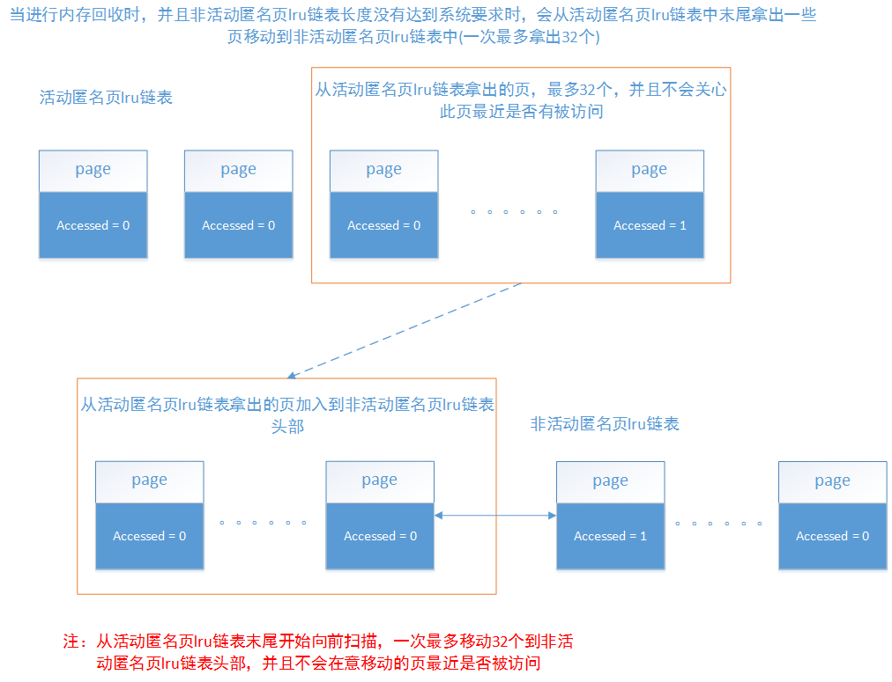<br>
> * 非活动->活动：<br>
> 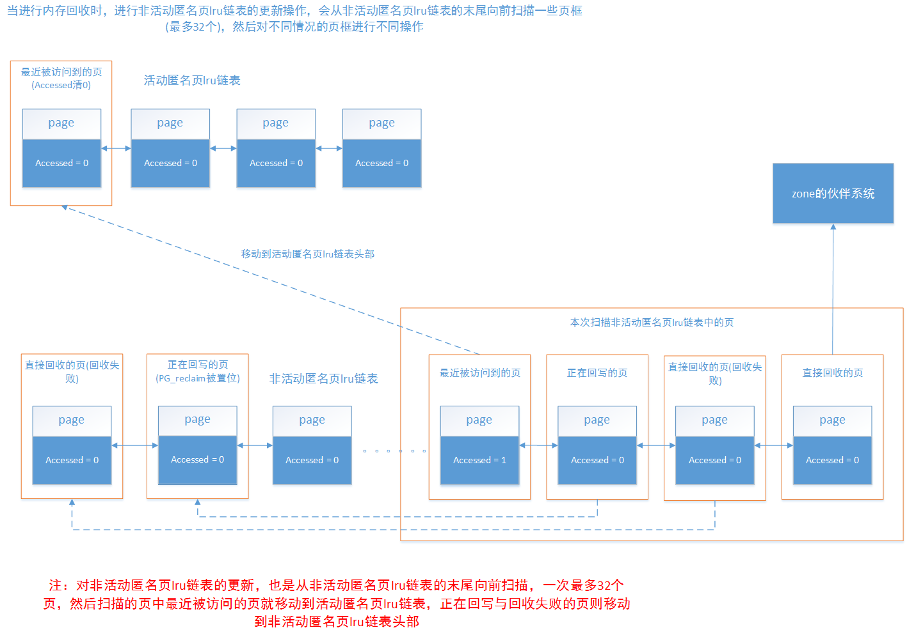<br>

> **文件页LRU链表更新**<br>
> * 活动->非活动：
> ```
> 与匿名页类似
> 区别1：PG_referenced置位的可执行页会移动到活动文件页lru链表头部
> 区别2：不会清除PG_referenced标志
> ```
> * 非活动->活动：<br>
> 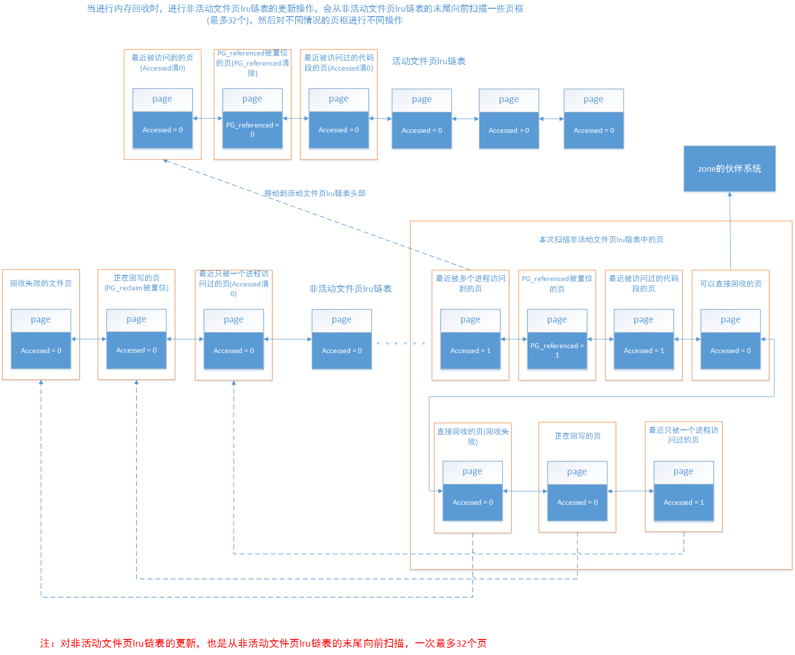

### 回收流程
#### 回收入口
> * 快速内存回收
> ```c
> get_page_from_freelist()
>   -> zone_reclaim()
>     -> __zone_reclaim()
>         	struct scan_control sc = {
>		         /* 最少一次回收SWAP_CLUSTER_MAX，最多一次回收1 << order个，应该是1024个 */
>		         .nr_to_reclaim = max(nr_pages, SWAP_CLUSTER_MAX),
>		         /* 当前进程明确禁止分配内存的IO操作(禁止__GFP_IO，__GFP_FS标志)，那么则清除__GFP_IO，__GFP_FS标志，表示不进行IO操作 */
>		         .gfp_mask = (gfp_mask = memalloc_noio_flags(gfp_mask)),
>		         .order = order,
>		         /* 优先级为4，默认是12，会比12一次扫描更多lru链表中的页框，而且扫描次数会比优先级为12的少，并且如果回收过程中回收到了足够页框，就会返回 */
>		         .priority = ZONE_RECLAIM_PRIORITY,
>		         /* 通过/proc/sys/vm/zone_reclaim_mode文件设置是否允许将脏页回写到磁盘，即使设为允许，快速内存回收也不能对脏文件页进行回写操作。
>		          * 当zone_reclaim_mode为0时，在这里是不允许页框回写的，
>		          */
>		         .may_writepage = !!(zone_reclaim_mode & RECLAIM_WRITE),
>		         /* 通过/proc/sys/vm/zone_reclaim_mode文件设置是否允许将匿名页回写到swap分区
>		          * 当zone_reclaim_mode为0时，在这里是不允许匿名页回写的，我们这里假设允许
>		          */
>		         .may_unmap = !!(zone_reclaim_mode & RECLAIM_SWAP),
>		         /* 允许对匿名页lru链表操作 */
>		         .may_swap = 1,
>	         };
>
>	         do {
>	              shrink_zone(zone, &sc, true);
>	         /* 没有回收到足够页框，并且循环次数没达到优先级次数，继续 */
>	         } while (sc.nr_reclaimed < nr_pages && --sc.priority >= 0);
>       ->shrink_zone()
> ```
>
> * 直接内存回收
> ```c
> __alloc_pages_slowpath()
>  -> __alloc_pages_direct_reclaim()
>    -> __perform_reclaim()
>      -> try_to_free_pages()
>           	struct scan_control sc = {
>		         /* 打算回收32个页框 */
>		         .nr_to_reclaim = SWAP_CLUSTER_MAX,
>		         .gfp_mask = (gfp_mask = memalloc_noio_flags(gfp_mask)),
>		         .order = order,
>		         .nodemask = nodemask,
>		         /* 优先级为默认的12 */
>		         .priority = DEF_PRIORITY,
>		         /* 与/proc/sys/vm/laptop_mode文件有关
>		          * laptop_mode为0，则允许进行回写操作，即使允许回写，直接内存回收也不能对脏文件页进行回写
>		          * 不过允许回写时，可以对非文件页进行回写
>		          */
>		         .may_writepage = !laptop_mode,
>		         .may_unmap = 1,
>		         .may_swap = 1,
>	        };
>        -> do_try_to_free_pages()
>               do {
>                     ...
>                     zones_reclaimable = shrink_zones(zonelist, sc);
>                     ...
>                  } while (--sc->priority >= 0);
>          -> shrink_zones()
>            -> shrink_zone()
> ```
>
> * kswapd内存回收
> ```c
> kswapd
>  -> balance_pgdat()
>	struct scan_control sc = {
>		.gfp_mask = GFP_KERNEL,
>		.order = order,
>		.priority = DEF_PRIORITY,
>		.may_writepage = !laptop_mode,
>		.may_unmap = 1,
>		.may_swap = 1,
>	};
>	do {
>		...
>		/*
>		 * Scan in the highmem->dma direction for the highest
>		 * zone which needs scanning
>		 */
>		for (i = pgdat->nr_zones - 1; i >= 0; i--) { //从高往低查找第一个不平衡的end_zone
>			struct zone *zone = pgdat->node_zones + i;
>			...
>			if (!zone_balanced(zone, order, 0, 0)) {
>				end_zone = i;
>				break;
>			}
>			...
>		}
> 		...
> 		/* 从低到end_zone回收 */
> 		for (i = 0; i <= end_zone; i++) {
>			struct zone *zone = pgdat->node_zones + i;
>			...
>			if (kswapd_shrink_zone(zone, end_zone,
>					       &sc, &nr_attempted))
>				raise_priority = false;
>			...
>		}
>		...
>	  /* 加大扫描粒度，检查从最低端zone到classzone_idx的zone是否平衡，
>	   * 一个zone的空闲页面处于WMARK_HIGH之上，则该zone管理的页面为balanced_pages，
>	   * 检查范围内的balanced_pages大于managed_pages的25%，则处于平衡状态
>	   */
>	} while (sc.priority >= 1 &&
>		 !pgdat_balanced(pgdat, order, *classzone_idx));
>    -> kswapd_shrink_zone()
>      -> shrink_zone()
> ```

#### 核心流程
> ```c
> shrink_zone()
>	...
>	do {
>		...
>		shrink_lruvec();
>			/* 对这个lru链表描述符中的每个lru链表，计算它们本次扫描应该扫描的页框数量
>			 * 计算好的每个lru链表需要扫描的页框数量保存在nr中
>			 * 每个lru链表需要扫描多少与sc->priority有关，sc->priority越小，那么扫描得越多
>			 */
>			get_scan_count()
>			for_each_evictable_lru(lru) {
>				if (nr[lru]) {
>					nr_to_scan = min(nr[lru], SWAP_CLUSTER_MAX);
>					nr[lru] -= nr_to_scan;
>
>					nr_reclaimed += shrink_list(lru, nr_to_scan,
>								    lruvec, sc);
>				}
>			}
>		...
>		shrink_slab();
>		...
>	  /* 回收的目标是2^(order+1)个页框，比要求的2^order多一倍。 */
>	} while (should_continue_reclaim(zone, sc->nr_reclaimed - nr_reclaimed,
>					 sc->nr_scanned - nr_scanned, sc));
>
> shrink_list
>   shrink_active_list
>     isolate_lru_pages //从lru链表的末尾隔离出一些页来放入到l_hold链表中
>     将最近被访问过的代码段的页移动到活动lru链表头，其余页都移动到非活动lru链表头
>   shrink_inactive_list
>     isolate_lru_pages //从lruvec这个lru链表描述符的lru类型的lru链表中隔离最多nr_to_scan个页出来，隔离时是从lru链表尾部开始拿，然后放到page_list
>
>    /* 上面的代码已经将非活动lru链表中的一些页拿出来放到page_list中了，这里是对page_list中的页进行内存回收
>     * 此函数的步骤:
>     * 1.此页是否在进行回写(两种情况会导致回写，之前进行内存回收时导致此页进行了回写；此页为脏页，系统自动将其回写)，这种情况同步回收和异步回收有不同的处理
>     * 2.此次回收时非强制进行回收，那要先判断此页能不能进行回收
>     *         如果是匿名页，只要最近此页被进程访问过，则将此页移动到活动lru链表头部，否则回收
>     *         如果是映射可执行文件的文件页，只要最近被进程访问过，就放到活动lru链表，否则回收
>     *         如果是其他的文件页，如果最近被多个进程访问过，移动到活动lru链表，如果只被1个进程访问过，但是PG_referenced置位了，也放入活动lru链表，其他情况回收
>     * 3.如果遍历到的page为匿名页，但是又不处于swapcache中，这里会尝试将其加入到swapcache中并把页标记为脏页，这个swapcache作为swap缓冲区，是一个address_space
>     * 4.对所有映射了此页的进程的页表进行此页的unmap操作
>     * 5.如果页为脏页，则进行回写，分同步和异步，同步情况是回写完成才返回，异步情况是加入块层的写入队列，标记页的PG_writeback表示正在回写就返回，此页将会被放到非活动lru链表头部
>     * 6.检查页的PG_writeback标志，如果此标志位0，则说明此页的回写完成(两种情况: 1.同步回收 2.之前异步回收对此页进行的回写已完成)，则从此页对应的address_space中的基树移除此页的结点，加入到free_pages链表
>     *        对于PG_writeback标志位1的，将其重新加入到page_list链表，这个链表之后会将里面的页放回到非活动lru链表末尾，下次进行回收时，如果页回写完成了就会被释放
>     * 7.对free_pages链表的页释放
>     *
>     * page_list中返回时有可能还有页，这些页是要放到非活动lru链表末尾的页，而这些页当中，有些页是正在进行回收的回写，当这些回写完成后，系统再次进行内存回收时，这些页就会被释放
>     *        而有一些页是不满足回收情况的页
>     * nr_dirty: page_list中脏页的数量
>     * nr_unqueued_dirty: page_list中脏页但并没有正在回写的页的数量
>     * nr_congested: page_list中正在进行回写并且设备正忙的页的数量(这些页可能回写很慢)
>     * nr_writeback: page_list中正在进行回写但不是在回收的页框数量
>     * nr_immediate: page_list中正在进行回写的回收页框数量
>     * 返回本次回收的页框数量
>     */
>     shrink_page_list
>    /*
>     * 将page_list中剩余的页放回它对应的lru链表中，这里的页有三种情况:
>     * 1.最近被访问了，放到活动lru链表头部
>     * 2.此页需要锁在内存中，加入到unevictablelru链表
>     * 3.此页为非活动页，移动到非活动lru链表头部
>     * 当页正在进行回写回收，当回写完成后，通过判断页的PG_reclaim可知此页正在回收，会把页移动到非活动lru链表末尾，具体见end_page_writeback()函数
>     * 加入lru的页page->_count--
>     * 因为隔离出来时page->_count++，而在lru中是不需要对page->_count++的
>     */
>     putback_inactive_pages
> ```

#### 不同类型页的回收
>
> 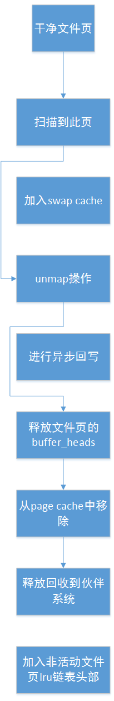
>|---| 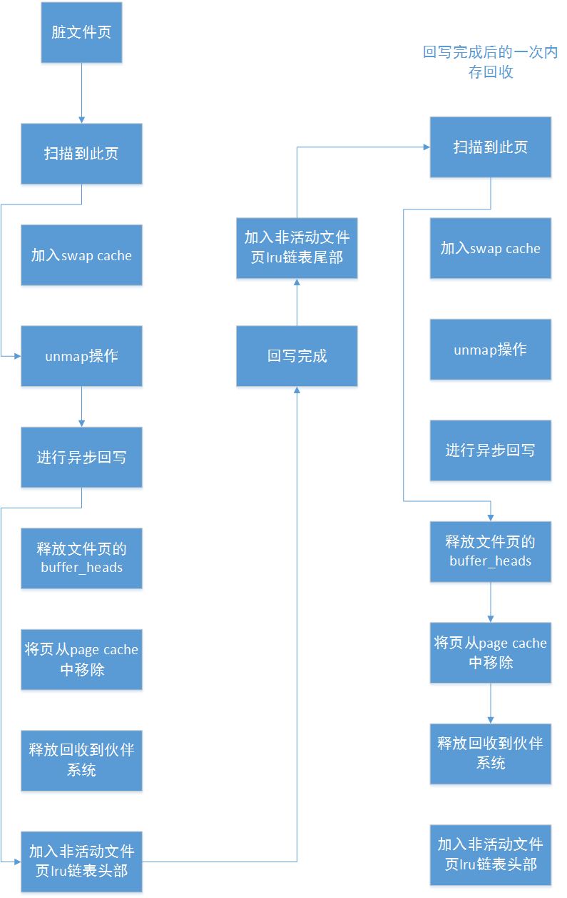
>|---| 

### Rmap
#### 版本1
> 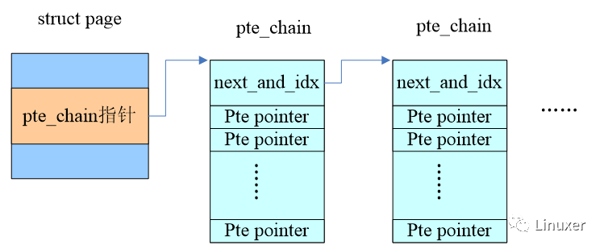

#### 版本2
> 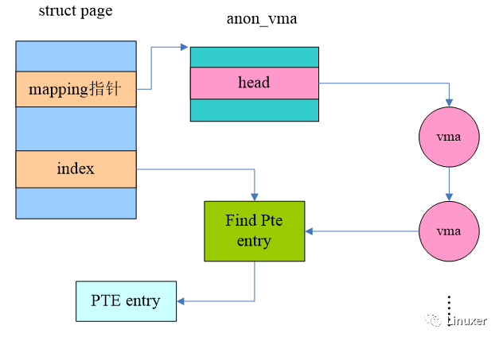
>
> 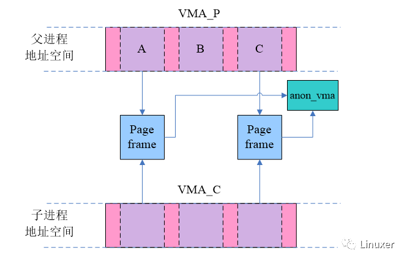
>
> 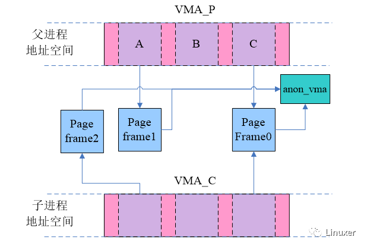

#### 版本3
> 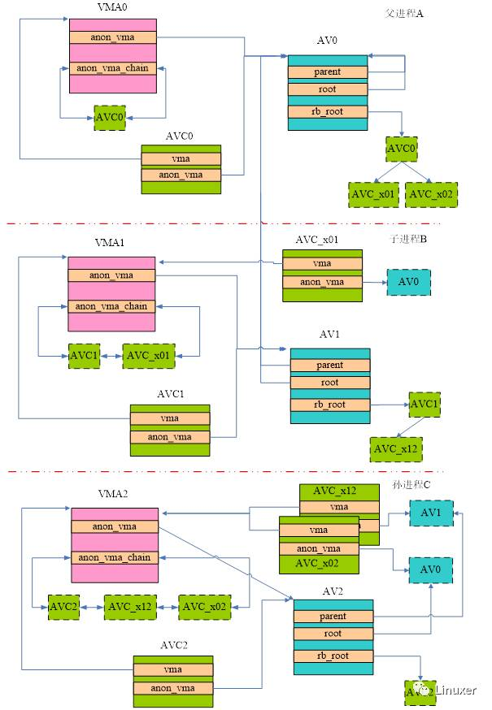
>
> **rmap过程**
>
> 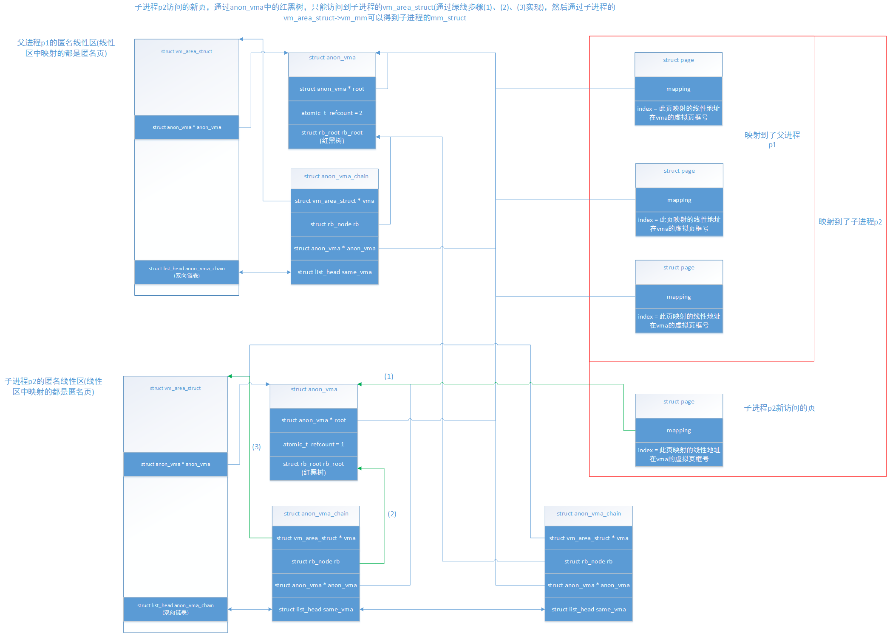
>
> 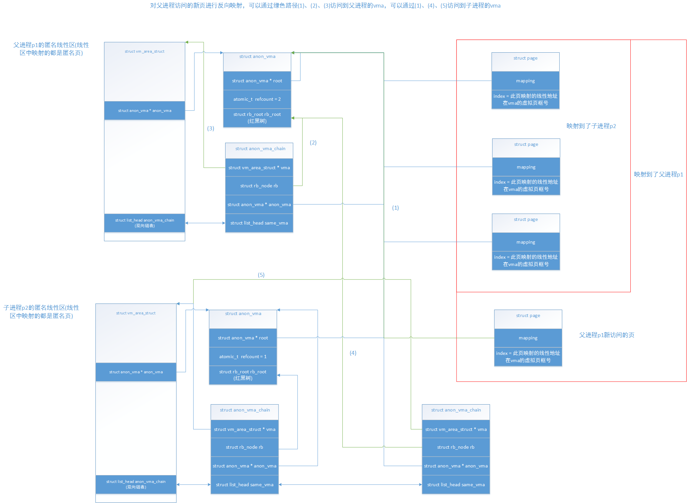

**关键数据结构**

```c
/* 内存描述符，每个进程都会有一个，除了内核线程(使用被调度出去的进程的mm_struct)和轻量级进程(使用父进程的mm_struct) */
/* 所有的内存描述符存放在一个双向链表中，链表中第一个元素是init_mm，它是初始化阶段进程0的内存描述符 */
struct mm_struct {
    /* 指向线性区对象的链表头，链表是经过排序的，按线性地址升序排列，里面包括了匿名映射线性区和文件映射线性区 */
    struct vm_area_struct *mmap;        /* list of VMAs */
    /* 指向线性区对象的红黑树的根，一个内存描述符的线性区会用两种方法组织，链表和红黑树，红黑树适合内存描述符有非常多线性区的情况 */
    struct rb_root mm_rb;
    u32 vmacache_seqnum;                   /* per-thread vmacache */
#ifdef CONFIG_MMU
    /* 在进程地址空间中找一个可以使用的线性地址空间，查找一个空闲的地址区间
     * len: 指定区间的长度
     * 返回新区间的起始地址
     */
    unsigned long (*get_unmapped_area) (struct file *filp,
                unsigned long addr, unsigned long len,
                unsigned long pgoff, unsigned long flags);
#endif
    /* 标识第一个分配的匿名线性区或文件内存映射的线性地址 */
    unsigned long mmap_base;        /* base of mmap area */
    unsigned long mmap_legacy_base;         /* base of mmap area in bottom-up allocations */
    unsigned long task_size;        /* size of task vm space */
    /* 所有vma中最大的结束地址 */
    unsigned long highest_vm_end;        /* highest vma end address */
    /* 指向页全局目录 */
    pgd_t * pgd;
    /* 次使用计数器，存放了共享此mm_struct的轻量级进程的个数，但所有的mm_users在mm_count的计算中只算作1 */
    atomic_t mm_users;        /* 初始为1 */
    /* 主使用计数器，当mm_count递减时，系统会检查是否为0，为0则解除这个mm_struct */
    atomic_t mm_count;        /* 初始为1 */
    /* 页表数 */
    atomic_long_t nr_ptes;            /* Page table pages */
    /* 线性区的个数，默认最多是65535个，系统管理员可以通过写/proc/sys/vm/max_map_count文件修改这个值 */
    int map_count;                /* number of VMAs */

    /* 线性区的自旋锁和页表的自旋锁 */
    spinlock_t page_table_lock;        /* Protects page tables and some counters */
    /* 线性区的读写信号量，当需要对某个线性区进行操作时，会获取 */
    struct rw_semaphore mmap_sem;

    /* 用于链入双向链表中 */
    struct list_head mmlist;        /* List of maybe swapped mm's.    These are globally strung
                         * together off init_mm.mmlist, and are protected
                         * by mmlist_lock
                         */

    /* 进程所拥有的最大页框数 */
    unsigned long hiwater_rss;    /* High-watermark of RSS usage */
    /* 进程线性区中的最大页数 */
    unsigned long hiwater_vm;    /* High-water virtual memory usage */

    /* 进程地址空间的大小(页框数) */
    unsigned long total_vm;        /* Total pages mapped */
    /* 锁住而不能换出的页的数量 */
    unsigned long locked_vm;    /* Pages that have PG_mlocked set */
    unsigned long pinned_vm;    /* Refcount permanently increased */
    /* 共享文件内存映射中的页数量 */
    unsigned long shared_vm;    /* Shared pages (files) */
    /* 可执行内存映射中的页数量 */
    unsigned long exec_vm;        /* VM_EXEC & ~VM_WRITE */
    /* 用户态堆栈的页数量 */
    unsigned long stack_vm;        /* VM_GROWSUP/DOWN */
    unsigned long def_flags;

    /* start_code: 可执行代码的起始位置
     * end_code: 可执行代码的最后位置
     * start_data: 已初始化数据的起始位置
     * end_data: 已初始化数据的最后位置
     */
    unsigned long start_code, end_code, start_data, end_data;

    /* start_brk:   堆的起始位置
     * brk:         堆的当前最后地址
     * start_stack: 用户态栈的起始地址
     */
    unsigned long start_brk, brk, start_stack;

    /* arg_start: 命令行参数的起始位置
     * arg_end:   命令行参数的最后位置
     * env_start: 环境变量的起始位置
     * env_end:   环境变量的最后位置
     */
    unsigned long arg_start, arg_end, env_start, env_end;

#ifdef CONFIG_MEMCG
    /* 所属进程 */
    struct task_struct __rcu *owner;
#endif

    /* 代码段中映射的可执行文件的file */
    struct file *exe_file;
　　......

};

/* 描述线性区结构
 * 内核尽力把新分配的线性区与紧邻的现有线性区进程合并。如果两个相邻的线性区访问权限相匹配，就能把它们合并在一起。
 * 每个线性区都有一组连续号码的页(非页框)所组成，而页只有在被访问的时候系统会产生缺页异常，在异常中分配页框
 */
struct vm_area_struct {
    /* 线性区内的第一个线性地址 */
    unsigned long vm_start;
    /* 线性区之外的第一个线性地址 */
    unsigned long vm_end;

    /* 整个链表会按地址大小递增排序 */
    /* vm_next: 线性区链表中的下一个线性区 */
    /* vm_prev: 线性区链表中的上一个线性区 */
    struct vm_area_struct *vm_next, *vm_prev;

    /* 用于组织当前内存描述符的线性区的红黑树的结点 */
    struct rb_node vm_rb;


    /* 此vma的子树中最大的空闲内存块大小(bytes) */
    unsigned long rb_subtree_gap;

    /* 指向所属的内存描述符 */
    struct mm_struct *vm_mm;
    /* 页表项标志的初值，当增加一个页时，内核根据这个字段的值设置相应页表项中的标志 */
    /* 页表中的User/Supervisor标志应当总被置1 */
    pgprot_t vm_page_prot;        /* Access permissions of this VMA. */
    /* 线性区标志
     * 读写可执行权限会复制到页表项中，由分页单元去检查这几个权限
     */
    unsigned long vm_flags;        /* Flags, see mm.h. */


    /* 链接到反向映射所使用的数据结构，用于文件映射的线性区，主要用于文件页的反向映射 */
    union {
        struct {
            struct rb_node rb;
            unsigned long rb_subtree_last;
        } linear;
        struct list_head nonlinear;
    } shared;

    /*
     * 指向匿名线性区链表头的指针，这个链表会将此mm_struct中的所有匿名线性区链接起来
     * 匿名的MAP_PRIVATE、堆和栈的vma都会存在于这个anon_vma_chain链表中
     * 如果mm_struct的anon_vma为空，那么其anon_vma_chain也一定为空
     */
    struct list_head anon_vma_chain; /* Serialized by mmap_sem &
                      * page_table_lock */
    /* 指向anon_vma数据结构的指针，对于匿名线性区，此为重要结构 */
    struct anon_vma *anon_vma;

    /* 指向线性区操作的方法，特殊的线性区会设置，默认会为空 */
    const struct vm_operations_struct *vm_ops;

    /* 如果此vma用于映射文件，那么保存的是在映射文件中的偏移量。如果是匿名线性区，它等于0或者vma开始地址对应的虚拟页框号(vm_start >> PAGE_SIZE)，这个虚拟页框号用于vma向下增长时反向映射的计算(栈) */
    unsigned long vm_pgoff;
    /* 指向映射文件的文件对象，也可能指向建立shmem共享内存中返回的struct file，如果是匿名线性区，此值为NULL或者一个匿名文件(这个匿名文件跟swap有关?待看) */
    struct file * vm_file;
    /* 指向内存区的私有数据 */
    void * vm_private_data;        /* was vm_pte (shared mem) */

　　......

#ifndef CONFIG_MMU
    struct vm_region *vm_region;
#endif
#ifdef CONFIG_NUMA
    struct mempolicy *vm_policy;
#endif

};

/* 匿名线性区描述符，每个匿名vma都会有一个这个结构 */
struct anon_vma {
    /* 指向此anon_vma所属的root */
    struct anon_vma *root;        /* Root of this anon_vma tree */
    /* 读写信号量 */
    struct rw_semaphore rwsem;    /* W: modification, R: walking the list */

    /* 红黑树中结点数量，初始化时为1，也就是只有本结点，当加入root的anon_vma的红黑树时，此值不变 */
    atomic_t refcount;


    /* 红黑树的根，用于存放引用了此anon_vma所属线性区中的页的其他线性区，用于匿名页反向映射 */
    struct rb_root rb_root;    /* Interval tree of private "related" vmas */
};

struct anon_vma_chain {
    /* 此结构所属的vma */
    struct vm_area_struct *vma;
    /* 此结构加入的红黑树所属的anon_vma */
    struct anon_vma *anon_vma;
    /* 用于加入到所属vma的anon_vma_chain链表中 */
    struct list_head same_vma;
    /* 用于加入到其他进程或者本进程vma的anon_vma的红黑树中 */
    struct rb_node rb;
    unsigned long rb_subtree_last;
#ifdef CONFIG_DEBUG_VM_RB
    unsigned long cached_vma_start, cached_vma_last;
#endif
};

struct page {
    /* First double word block */
    /* 用于页描述符，一组标志(如PG_locked、PG_error)，同时页框所在的管理区和node的编号也保存在当中 */
    /* 在lru算法中主要用到两个标志
     * PG_active: 表示此页当前是否活跃，当放到active_lru链表时，被置位
     * PG_referenced: 表示此页最近是否被访问，每次页面访问都会被置位
     */
    unsigned long flags;        /* Atomic flags, some possibly
                     * updated asynchronously */
    union {
        /* 最低两位用于判断类型，其他位数用于保存指向的地址
         * 如果为空，则该页属于交换高速缓存(swap cache，swap时会产生竞争条件，用swap cache解决)
         * 不为空，如果最低位为1，该页为匿名页，指向对应的anon_vma(分配时需要对齐)
         * 不为空，如果最低位为0，则该页为文件页，指向文件的address_space
         */
        struct address_space *mapping;    /* If low bit clear, points to
                         * inode address_space, or NULL.
                         * If page mapped as anonymous
                         * memory, low bit is set, and
                         * it points to anon_vma object:
                         * see PAGE_MAPPING_ANON below.
                         */
        /* 用于SLAB描述符，指向第一个对象的地址 */
        void *s_mem;            /* slab first object */
    };


    /* Second double word */
    struct {
        union {
            /* 作为不同的含义被几种内核成分使用。例如，它在页磁盘映像或匿名区中标识存放在页框中的数据的位置，或者它存放一个换出页标识符
             * 当此页作为映射页(文件映射)时，保存这块页的数据在整个文件数据中以页为大小的偏移量
             * 当此页作为匿名页时，保存此页在线性区vma内的页索引或者是页的线性地址/PAGE_SIZE。
             * 对于匿名页的page->index表示的是page在vma中的虚拟页框号(此页的开始线性地址 >> PAGE_SIZE)。共享匿名页的产生应该只有在fork，clone完成并写时复制之前。
             */
            pgoff_t index;        /* Our offset within mapping. */
            /* 用于SLAB和SLUB描述符，指向空闲对象链表 */
            void *freelist;
            /* 当管理区页框分配器压力过大时，设置这个标志就确保这个页框专门用于释放其他页框时使用 */
            bool pfmemalloc;    /* If set by the page allocator,
                         * ALLOC_NO_WATERMARKS was set
                         * and the low watermark was not
                         * met implying that the system
                         * is under some pressure. The
                         * caller should try ensure
                         * this page is only used to
                         * free other pages.
                         */
        };

　　　　......
}
```
