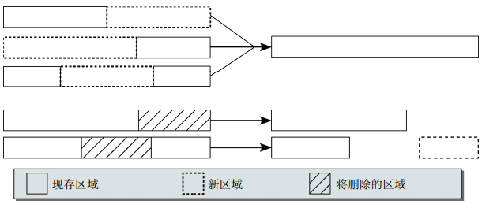

## 进程地址空间
[TOC]
> 
### VMA ops
> 
> 
```
API:
find_vma
find_vma_intersection
find_vma_prev
insert_vm_struct
vma_merge
```
### brk
> <br>
> 

### mmap
> 
### 缺页异常
> 
#### do_anonymous_page
> 

#### do_fault
> **do_read_fault**
```
  do_fault_around //把异常地址周围已有的page cache提前建立好映射
  __do_fault //新建page cache
  检查pte
  设置页表pte
```
>> *do_fault_around：*
> 

> **do_cow_fault**
```
  分配new page，gfp_mask: GFP_HIGHUSER | __GFP_MOVABLE
  __do_fault //读取文件内容到fault page
  拷贝fault page内容到new page
  检查pte
  设置页表pte
  new page加入活跃LRU链表
```
> **do_shared_fault**
```
  __do_fault
  do_page_mkwrite
  检查pte
  设置页表pte(可写)
  设置page为脏页
  balance_dirty_pages_ratelinited
```
#### do_wp_page
> 
